# dayu_widgets

一个 [PySide](https://wiki.qt.io/PySide) 的组件库

主要参考了 [AntDesign](https://ant.design/) 组件库，其他参考了 [iView](https://www.iviewui.com/) 组件库，微信基础组件。

提供**亮色(light)** 和 **暗色(dark)** 两种主题，每种主题可以设置主题颜色。
以下截图以：

* 暗色 #fa8c16
* 亮色 #1890ff
******
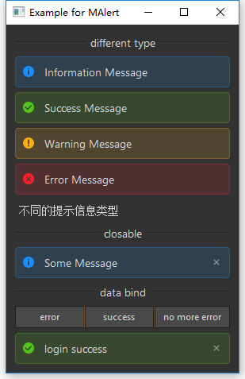

******
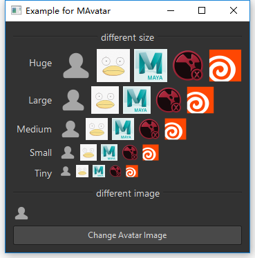
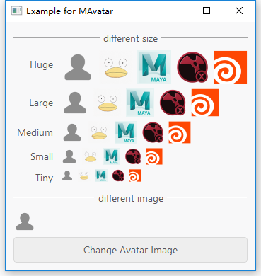
******
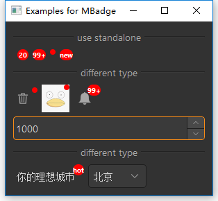
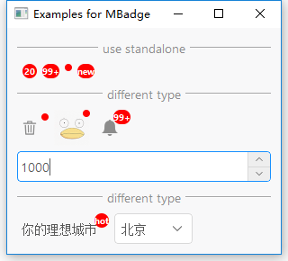
******
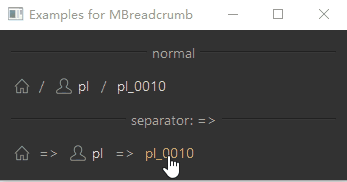
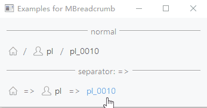
******
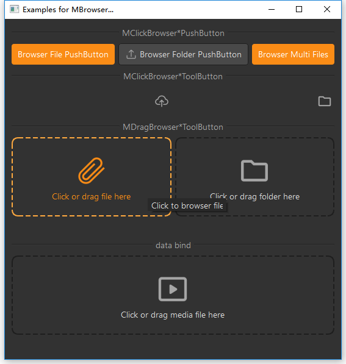
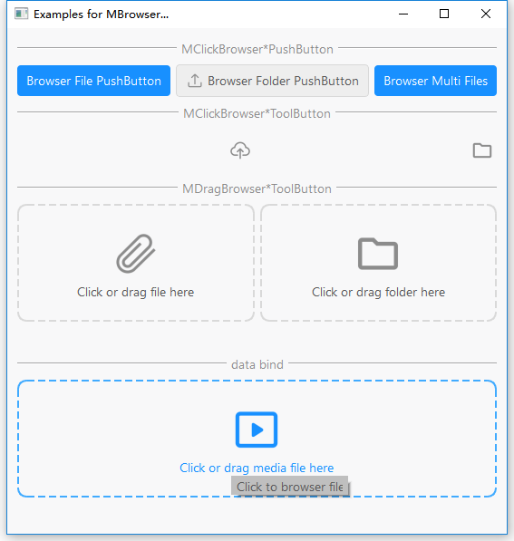
******
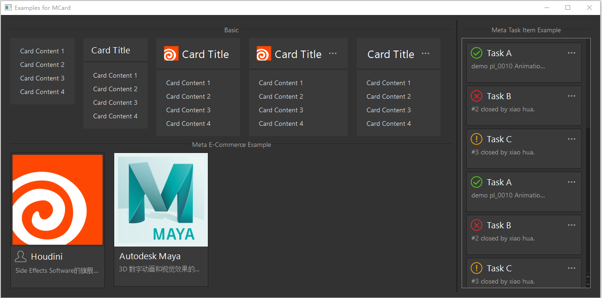
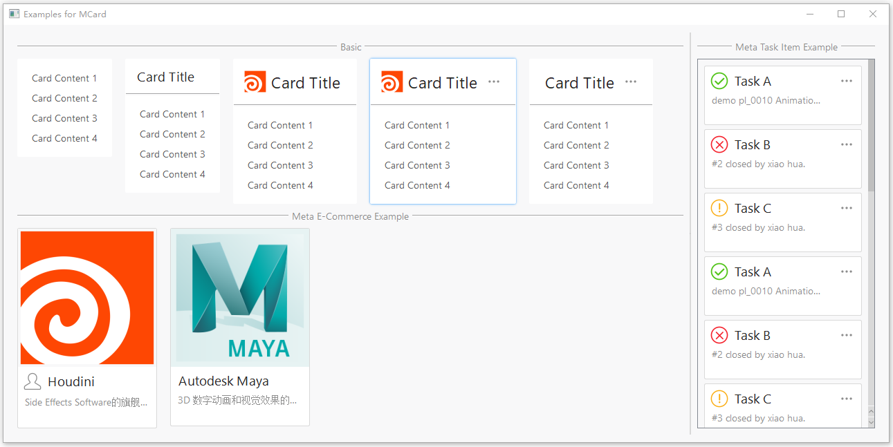
******
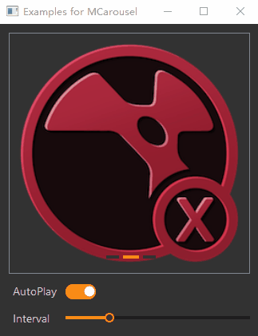
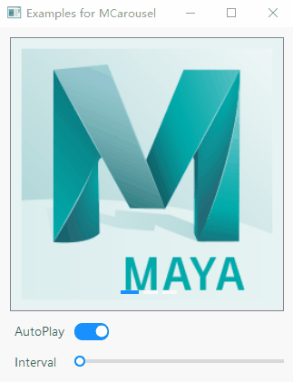
******
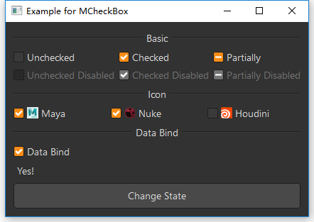
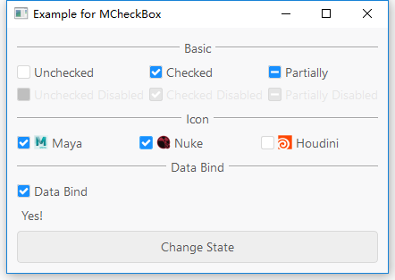
******
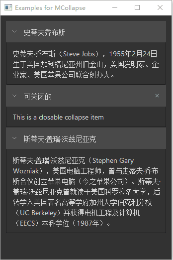
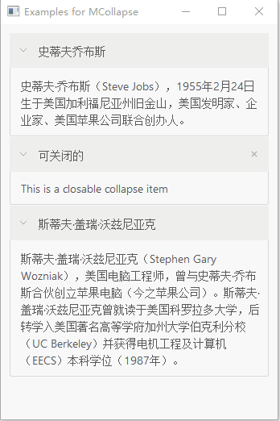
******
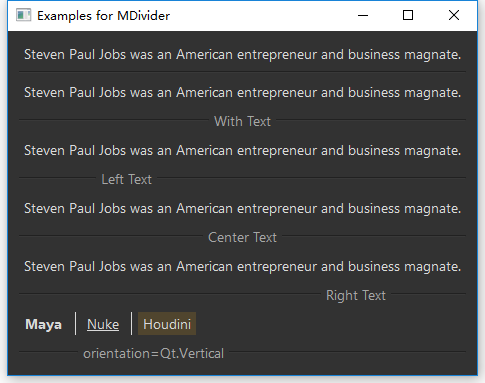
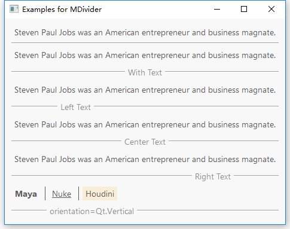
******

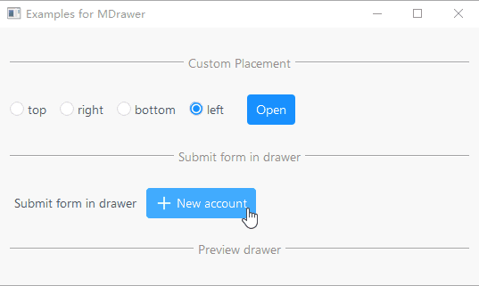
******
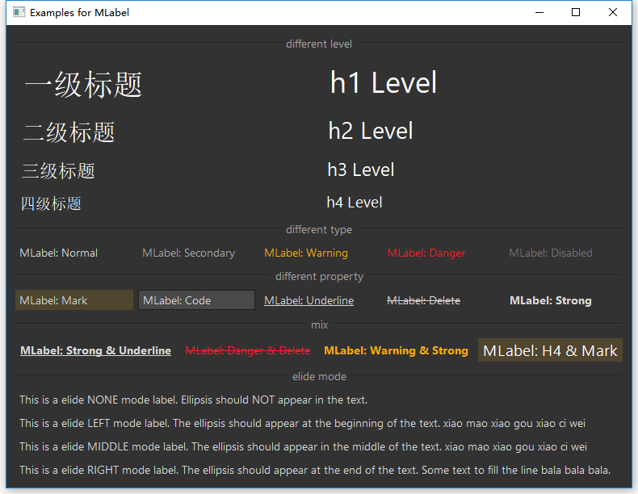
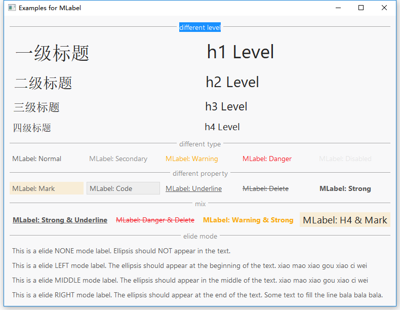
******
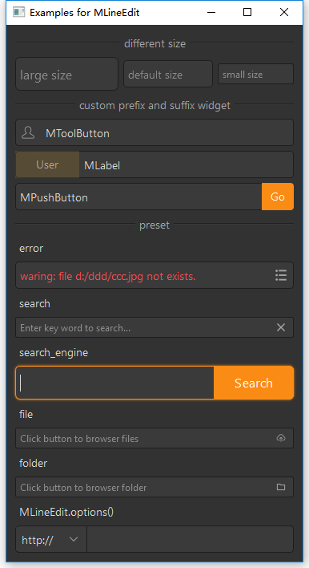
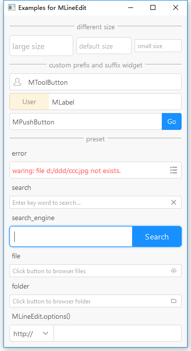
******
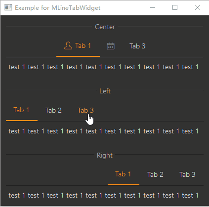

******
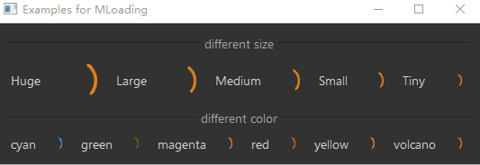
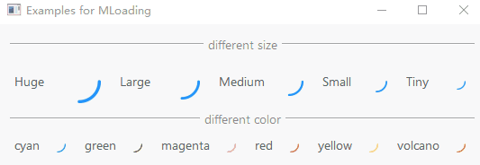
******
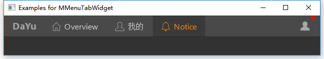
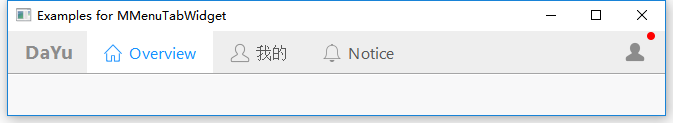
******
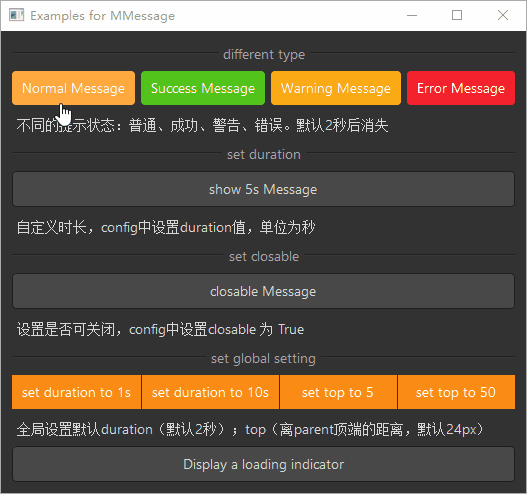
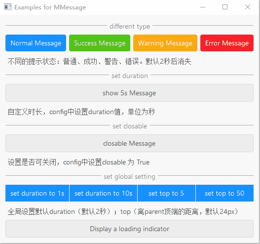
******
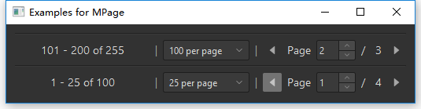
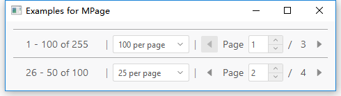
******

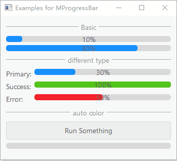
******
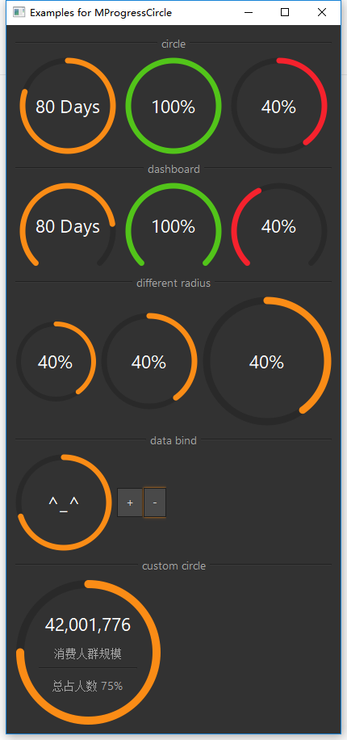
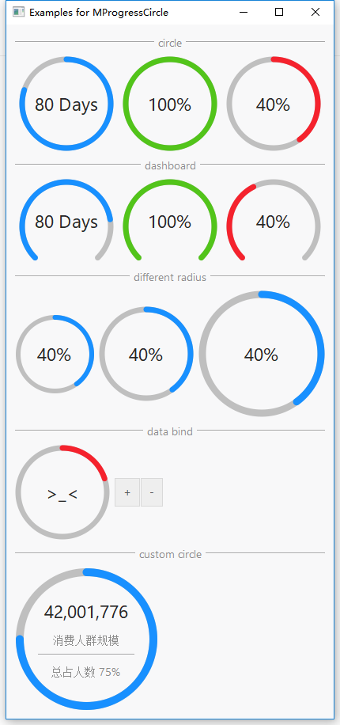
******
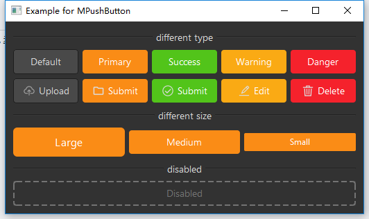
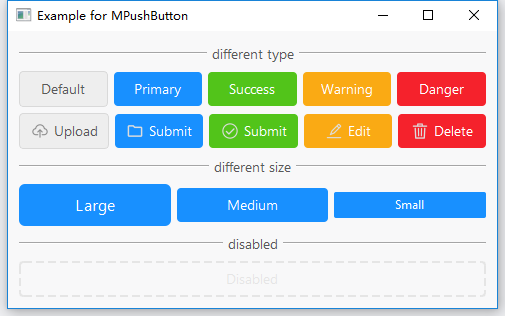
******
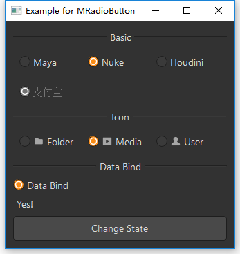
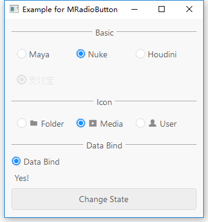
******
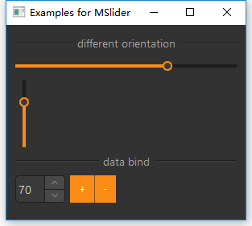
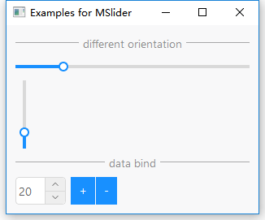
******
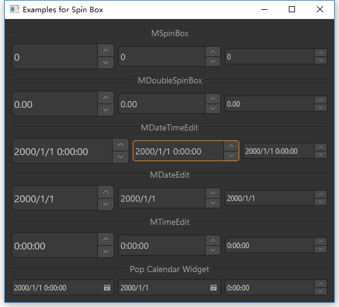
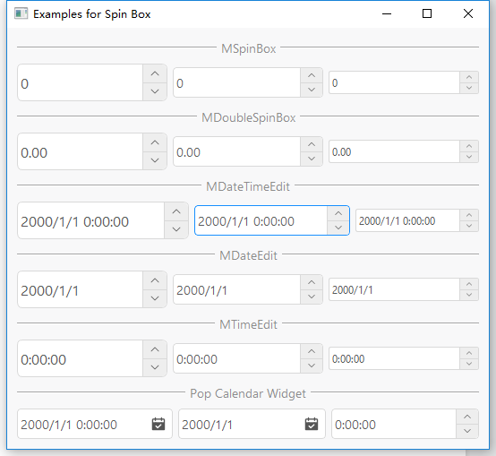
******
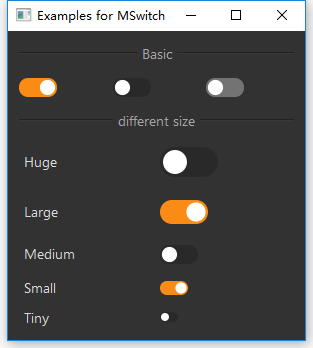
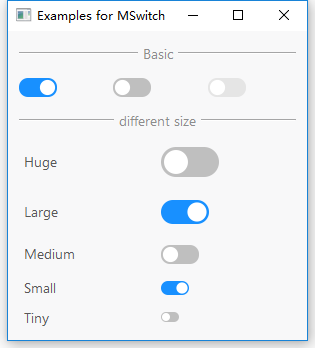
******
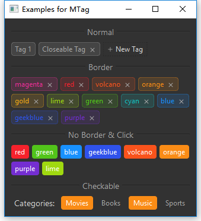
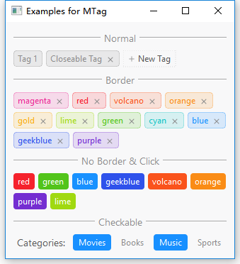
******

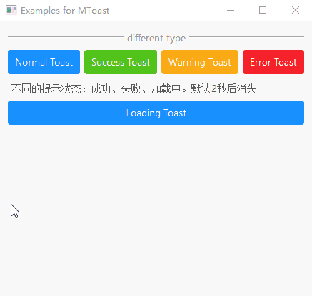
******
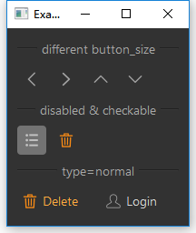

******