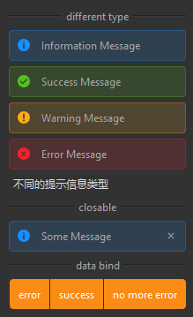

## 简介
MAlert 是一个基于 QtWidgets.QWidget 的组件，用于显示不同类型的反馈信息。该组件支持四种反馈类型：信息（Info）、成功（Success）、警告（Warning）和错误（Error）。MAlert 可以显示图标、文本，并且可以设置是否显示关闭按钮。


******
## 初始化
  - `alert = MAlert(text="This is an info message.")`
********
## 设置显示的文本
  - `alert.set_dayu_text("This is a new message.")`
******
## 设置反馈类型
  - `alert.set_dayu_type(MAlert.InfoType)`
******
## 设置是否显示图标
  - `alert.set_show_icon(True)`
******
## 设置是否显示关闭按钮
  - `alert.set_closable(True)`
******
## 快捷方法
  - `alert.info().closable()`
    - info(): 设置为信息类型。
    - success(): 设置为成功类型。
    - warning(): 设置为警告类型。
    - error(): 设置为错误类型。
    - closable(): 设置为可关闭。
******
## 双向绑定
  - ```python
    data_bind_alert = MAlert(parent=self)
    data_bind_alert.set_closable(True)
    self.register_field("msg", "")
    self.register_field("msg_type", MAlert.InfoType)
    self.bind("msg", data_bind_alert, "dayu_text")
    self.bind("msg_type", data_bind_alert, "dayu_type")
    ```
******
## 示例代码

```python
import functools
from Qt import QtWidgets
from dayu_widgets.alert import MAlert
from dayu_widgets.button_group import MPushButtonGroup
from dayu_widgets.divider import MDivider
from dayu_widgets.field_mixin import MFieldMixin
from dayu_widgets.label import MLabel
class AlertExample(QtWidgets.QWidget, MFieldMixin):
    def __init__(self, parent=None):
        super(AlertExample, self).__init__(parent)
        self.setWindowTitle("Example for MAlert")
        main_lay = QtWidgets.QVBoxLayout()
        self.setLayout(main_lay)
        main_lay.addWidget(MDivider("different type"))
        main_lay.addWidget(MAlert(text="Information Message", parent=self).info())
        main_lay.addWidget(MAlert(text="Success Message", parent=self).success())
        main_lay.addWidget(MAlert(text="Warning Message", parent=self).warning())
        main_lay.addWidget(MAlert(text="Error Message", parent=self).error())

        closable_alert = MAlert("Some Message", parent=self).closable()

        main_lay.addWidget(MLabel("不同的提示信息类型"))
        main_lay.addWidget(MDivider("closable"))
        main_lay.addWidget(closable_alert)
        main_lay.addWidget(MDivider("data bind"))
        self.register_field("msg", "")
        self.register_field("msg_type", MAlert.InfoType)

        data_bind_alert = MAlert(parent=self)
        data_bind_alert.set_closable(True)

        self.bind("msg", data_bind_alert, "dayu_text")
        self.bind("msg_type", data_bind_alert, "dayu_type")
        button_grp = MPushButtonGroup()
        button_grp.set_button_list(
            [
                {
                    "text": "error",
                    "clicked": functools.partial(
                        self.slot_change_alert, "password is wrong", MAlert.ErrorType
                    ),
                },
                {
                    "text": "success",
                    "clicked": functools.partial(
                        self.slot_change_alert, "login success", MAlert.SuccessType
                    ),
                },
                {
                    "text": "no more error",
                    "clicked": functools.partial(
                        self.slot_change_alert, "", MAlert.InfoType
                    ),
                },
            ]
        )
        main_lay.addWidget(button_grp)
        main_lay.addWidget(data_bind_alert)
        main_lay.addStretch()
    def slot_change_alert(self, alert_text, alert_type):
        self.set_field("msg_type", alert_type)
        self.set_field("msg", alert_text)
if __name__ == "__main__":
    # Import local modules
    from dayu_widgets import dayu_theme
    from dayu_widgets.qt import application
    with application() as app:
        test = AlertExample()
        dayu_theme.apply(test)
        test.show()
```