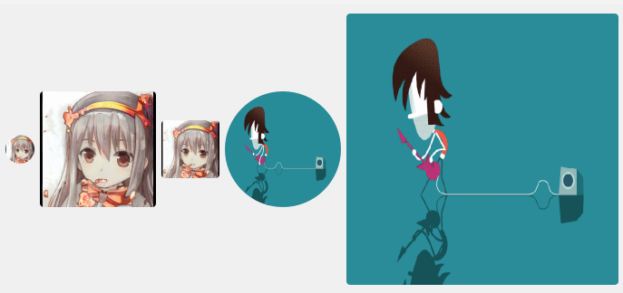

## 简介
`CAvatar` 是一个基于 `PySide2` 的自定义控件，用于显示圆形或圆角矩形的头像。支持从网络或本地加载图片，并且可以添加旋转动画效果。


******
## 代码
```python
import asyncio
import os
import aiohttp
from PySide2.QtCore import QRectF, Qt, QSize, QTimer, QPropertyAnimation, \
    QPointF, Property, QBuffer
from PySide2.QtGui import QPixmap, QColor, QPainter, QPainterPath, QMovie
from PySide2.QtWidgets import QWidget, QApplication, QVBoxLayout, QHBoxLayout
from qasync import QEventLoop, asyncSlot
class CAvatar(QWidget):
    Circle = 0  # 圆圈
    Rectangle = 1  # 圆角矩形
    SizeLarge = QSize(128, 128)
    SizeMedium = QSize(64, 64)
    SizeSmall = QSize(32, 32)
    StartAngle = 0  # 起始旋转角度
    EndAngle = 360  # 结束旋转角度
    def __init__(self, *args, shape=0, url='', cacheDir=False, size=QSize(64, 64), animation=False, **kwargs):
        super(CAvatar, self).__init__(*args, **kwargs)
        self.url = ''
        self._angle = 0  # 角度
        self.pradius = 0  # 加载进度条半径
        self.animation = animation  # 是否使用动画
        self._movie = None  # 动态图
        self._pixmap = QPixmap()  # 图片对象
        self.pixmap = QPixmap()  # 被绘制的对象
        self.isGif = url.endswith('.gif')
        # 进度动画定时器
        self.loadingTimer = QTimer(self, timeout=self.onLoading)
        # 旋转动画
        self.rotateAnimation = QPropertyAnimation(self, b'angle', self, loopCount=1)
        self.setShape(shape)
        self.setCacheDir(cacheDir)
        self.setSize(size)
        self.setUrl(url)
    def paintEvent(self, event):
        super(CAvatar, self).paintEvent(event)
        # 画笔
        painter = QPainter(self)
        painter.setRenderHint(QPainter.Antialiasing, True)
        painter.setRenderHint(QPainter.HighQualityAntialiasing, True)
        painter.setRenderHint(QPainter.SmoothPixmapTransform, True)
        # 绘制
        path = QPainterPath()
        diameter = min(self.width(), self.height())
        if self.shape == self.Circle:
            radius = int(diameter / 2)
        elif self.shape == self.Rectangle:
            radius = 4
        halfW = self.width() / 2
        halfH = self.height() / 2
        painter.translate(halfW, halfH)
        path.addRoundedRect(
            QRectF(-halfW, -halfH, diameter, diameter), radius, radius)
        painter.setClipPath(path)
        # 如果是动画效果
        if self.rotateAnimation.state() == QPropertyAnimation.Running:
            painter.rotate(self._angle)  # 旋转
            painter.drawPixmap(
                QPointF(-self.pixmap.width() / 2, -self.pixmap.height() / 2), self.pixmap)
        else:
            painter.drawPixmap(-int(halfW), -int(halfH), self.pixmap)
        # 如果在加载
        if self.loadingTimer.isActive():
            diameter = 2 * self.pradius
            painter.setBrush(
                QColor(45, 140, 240, int((1 - self.pradius / 10) * 255)))
            painter.setPen(Qt.NoPen)
            painter.drawRoundedRect(
                QRectF(-self.pradius, -self.pradius, diameter, diameter), self.pradius, self.pradius)
    def enterEvent(self, event):
        """鼠标进入动画
        :param event:
        """
        if not (self.animation):
            return
        self.rotateAnimation.stop()
        cv = self.rotateAnimation.currentValue() or self.StartAngle
        self.rotateAnimation.setDuration(
            540 if cv == 0 else int(cv / self.EndAngle * 540))
        self.rotateAnimation.setStartValue(cv)
        self.rotateAnimation.setEndValue(self.EndAngle)
        self.rotateAnimation.start()
    def leaveEvent(self, event):
        """鼠标离开动画
        :param event:
        """
        if not (self.animation):
            return
        self.rotateAnimation.stop()
        cv = self.rotateAnimation.currentValue() or self.EndAngle
        self.rotateAnimation.setDuration(int(cv / self.EndAngle * 540))
        self.rotateAnimation.setStartValue(cv)
        self.rotateAnimation.setEndValue(self.StartAngle)
        self.rotateAnimation.start()
    def onLoading(self):
        """更新进度动画
        """
        if self.loadingTimer.isActive():
            if self.pradius > 9:
                self.pradius = 0
            self.pradius += 1
        else:
            self.pradius = 0
        self.update()
    def onFinished(self, data):
        """图片下载完成
        """
        self.loadingTimer.stop()
        self.pradius = 0
        if self.isGif:
            buffer = QBuffer()
            buffer.open(QBuffer.ReadWrite)
            buffer.write(data)
            buffer.seek(0)
            self._movie = QMovie(self)
            self._movie.setDevice(buffer)
            if self._movie.isValid():
                self._movie.frameChanged.connect(self._resizeGifPixmap)
                self._movie.start()
        else:
            self._pixmap.loadFromData(data)
            if self._pixmap.isNull():
                self._pixmap = QPixmap(self.size())
                self._pixmap.fill(QColor(204, 204, 204))
            self._resizePixmap()
    def onError(self, code):
        """下载出错了
        :param code:
        """
        self._pixmap = QPixmap(self.size())
        self._pixmap.fill(QColor(204, 204, 204))
        self._resizePixmap()
    async def refresh(self):
        """强制刷新
        """
        await self._get(self.url)
    def isLoading(self):
        """判断是否正在加载
        """
        return self.loadingTimer.isActive()
    def setShape(self, shape):
        """设置形状
        :param shape:        0=圆形, 1=圆角矩形
        """
        self.shape = shape
    @asyncSlot()
    async def setUrl(self, url):
        """设置url,可以是本地路径,也可以是网络地址
        :param url:
        """
        self.url = url
        await self._get(url)
    def setCacheDir(self, cacheDir=''):
        """设置本地缓存路径
        :param cacheDir:
        """
        self.cacheDir = cacheDir
        if cacheDir and not os.path.exists(cacheDir):
            os.makedirs(cacheDir)
    def setSize(self, size):
        """设置固定尺寸
        :param size:
        """
        if not isinstance(size, QSize):
            size = self.SizeMedium
        self.setMinimumSize(size)
        self.setMaximumSize(size)
        self._resizePixmap()
    @Property(int)
    def angle(self):
        return self._angle
    @angle.setter
    def angle(self, value):
        self._angle = value
        self.update()
    def _resizePixmap(self):
        """缩放图片
        """
        if not self._pixmap.isNull():
            self.pixmap = self._pixmap.scaled(
                self.width(), self.height(), Qt.IgnoreAspectRatio, Qt.SmoothTransformation)
        self.update()
    def _resizeGifPixmap(self, _):
        """缩放动画图片
        """
        if self._movie:
            self.pixmap = self._movie.currentPixmap().scaled(
                self.width(), self.height(), Qt.IgnoreAspectRatio, Qt.SmoothTransformation)
        self.update()
    async def _get(self, url):
        """设置图片或者请求网络图片
        :param url:
        """
        if not url:
            self.onError('')
            return
        if url.startswith('http') and not self.loadingTimer.isActive():
            self.pradius = 0
            self.loadingTimer.start(50)  # 显示进度动画
            try:
                async with aiohttp.ClientSession() as session:
                    async with session.get(url) as response:
                        if response.status == 200:
                            data = await response.read()
                            self.onFinished(data)
                        else:
                            self.onError(response.status)
            except Exception as e:
                self.onError(str(e))
            finally:
                self.loadingTimer.stop()
                self.pradius = 0
        elif os.path.exists(url) and os.path.isfile(url):
            if self.isGif:
                self._movie = QMovie(url, parent=self)
                if self._movie.isValid():
                    self._movie.frameChanged.connect(self._resizeGifPixmap)
                    self._movie.start()
            else:
                self._pixmap = QPixmap(url)
                self._resizePixmap()
        else:
            self.onError('')
if __name__ == '__main__':
    # 创建主循环
    app = QApplication([])
    # 创建异步事件循环
    loop = QEventLoop(app)
    asyncio.set_event_loop(loop)
    widget = QWidget()
    layout = QHBoxLayout()
    widget.setLayout(layout)
    # 网络图像（圆形）
    avatar_1 = CAvatar(shape=CAvatar.Circle, url='https://www.thiswaifudoesnotexist.net/example-1000.jpg',
                       size=CAvatar.SizeSmall)
    # 网络图像（矩形）(大)
    avatar_2 = CAvatar(shape=CAvatar.Rectangle, url='https://www.thiswaifudoesnotexist.net/example-1000.jpg',
                       size=CAvatar.SizeLarge)
    # 网络图像（矩形）（动画）
    avatar_3 = CAvatar(shape=CAvatar.Rectangle, url='https://www.thiswaifudoesnotexist.net/example-1000.jpg',
                       animation=True)
    # 本地图像（圆形）（GIF）
    avatar_4 = CAvatar(shape=CAvatar.Circle, url='duitang.gif', animation=True,
                       size=CAvatar.SizeLarge)
    # 网络图像（矩形）（GIF）
    avatar_5 = CAvatar(shape=CAvatar.Rectangle,
                       url='https://c-ssl.dtstatic.com/uploads/item/201806/09/20180609172159_G5MJM.thumb.1000_0.gif',
                       size=QSize(300, 300))
    layout.addWidget(avatar_1)
    layout.addWidget(avatar_2)
    layout.addWidget(avatar_3)
    layout.addWidget(avatar_4)
    layout.addWidget(avatar_5)
    # 显示窗口
    widget.show()
    # 显示窗口
    with loop:
        loop.run_forever()
```
********
## 主要功能
  - 支持圆形和圆角矩形两种形状。
  - 支持从网络或本地加载图片。
  - 支持 GIF 动图。
  - 支持加载进度动画。
  - 支持鼠标悬停时的旋转动画效果。
********
## 初始化参数
 - shape: 头像形状，默认为圆形（0）。
 - url: 图片的 URL 或本地路径。
 - cacheDir: 本地缓存目录。
 - size: 头像的尺寸，默认为中等尺寸（64x64）。
 - animation: 是否启用旋转动画，默认为不启用。
******
## 设置控件大小
  - `avatar.huge()  # 设置为巨大尺寸`
  - `avatar.large()  # 设置为大尺寸`
  - `avatar.medium()  # 设置为中尺寸`
  - `avatar.small()  # 设置为小尺寸`
  - `avatar.tiny()  # 设置为微小尺寸`
******
## 双向绑定
  
******
