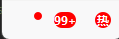
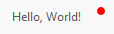
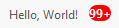
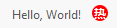
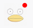

## 简介

`MBadge` 类继承自 `QWidget`，用于创建一个徽标组件，通常出现在通知或用户头像附近，显示未读消息的数量或其他信息。MBadge
支持三种样式：

- Dot: 显示一个小圆点。
- Count: 显示一个数字。
- Text: 显示一段文本。

******

## 初始化

- `badge_dot = MBadge.dot(show=True, widget=None) # 小圆点`
- `badge_count = MBadge.count(count=80, widget=None) # 数字`
    - `badge_count.set_dayu_overflow(99) # 超过99显示99+`
    - `badge_count.set_dayu_count(200) # 设置数字`
- `badge_text = MBadge.text(text="热", widget=None) # 设置文本`


********

## 附着控件

- `badge_dot = MBadge.dot(show=True, widget=self.label)`
- `badge_count = MBadge.count(count=80, widget=self.label)`
- `badge_text = MBadge.text(text="热", widget=self.label)`

******

## 附着`MToolButton`控件

- ```python
    button = MToolButton().svg("trash_line.svg")
    badge = MBadge.dot(True, widget=button)
    button.clicked.connect(lambda: badge.set_dayu_dot(False))
    self.sub_layout = QHBoxLayout()
    self.sub_layout.addWidget(badge)
    self.sub_layout.addStretch()
    self.main_layout.addLayout(self.sub_layout)
    ```
  

******

## 附着`MAvatar`控件

- ```python
    avatar = MAvatar.large(MPixmap("avatar.png"))
    badge = MBadge.dot(True, widget=avatar)
    self.sub_layout = QHBoxLayout()
    self.sub_layout.addWidget(badge)
    self.sub_layout.addStretch()
    self.main_layout.addLayout(self.sub_layout)
    ```
  

******

## 示例代码

```python
from Qt import QtWidgets
from dayu_widgets.avatar import MAvatar
from dayu_widgets.badge import MBadge
from dayu_widgets.combo_box import MComboBox
from dayu_widgets.divider import MDivider
from dayu_widgets.field_mixin import MFieldMixin
from dayu_widgets.label import MLabel
from dayu_widgets.menu import MMenu
from dayu_widgets.qt import MPixmap
from dayu_widgets.spin_box import MSpinBox
from dayu_widgets.tool_button import MToolButton
class BadgeExample(QtWidgets.QWidget, MFieldMixin):
    def __init__(self, parent=None):
        super(BadgeExample, self).__init__(parent)
        self.setWindowTitle("Examples for MBadge")
        self._init_ui()
    def _init_ui(self):
        standalone_lay = QtWidgets.QHBoxLayout()
        standalone_lay.addWidget(MBadge.count(0))
        standalone_lay.addWidget(MBadge.count(20))
        standalone_lay.addWidget(MBadge.count(100))
        standalone_lay.addWidget(MBadge.dot(True))
        standalone_lay.addWidget(MBadge.text("new"))
        standalone_lay.addStretch()
        button = MToolButton().svg("trash_line.svg")
        avatar = MAvatar.large(MPixmap("avatar.png"))
        button_alert = MToolButton().svg("alert_fill.svg").large()
        badge_1 = MBadge.dot(True, widget=button)
        badge_2 = MBadge.dot(True, widget=avatar)
        badge_3 = MBadge.dot(True, widget=button_alert)
        button.clicked.connect(lambda: badge_1.set_dayu_dot(False))
        spin_box = MSpinBox()
        spin_box.setRange(0, 9999)
        spin_box.valueChanged.connect(badge_3.set_dayu_count)
        spin_box.setValue(1)
        self.register_field("button1_selected", "北京")
        menu1 = MMenu(parent=self)
        menu1.set_data(["北京", "上海", "广州", "深圳"])
        select1 = MComboBox()
        select1.set_menu(menu1)
        self.bind("button1_selected", select1, "value", signal="sig_value_changed")
        badge_hot = MBadge.text("hot", widget=MLabel("你的理想城市  "))
        sub_lay1 = QtWidgets.QHBoxLayout()
        sub_lay1.addWidget(badge_1)
        sub_lay1.addWidget(badge_2)
        sub_lay1.addWidget(badge_3)
        sub_lay1.addStretch()
        sub_lay2 = QtWidgets.QHBoxLayout()
        sub_lay2.addWidget(badge_hot)
        sub_lay2.addWidget(select1)
        sub_lay2.addStretch()
        main_lay = QtWidgets.QVBoxLayout()
        main_lay.addWidget(MDivider("use standalone"))
        main_lay.addLayout(standalone_lay)
        main_lay.addWidget(MDivider("different type"))
        main_lay.addLayout(sub_lay1)
        main_lay.addWidget(spin_box)
        main_lay.addWidget(MDivider("different type"))
        main_lay.addLayout(sub_lay2)
        main_lay.addStretch()
        self.setLayout(main_lay)
if __name__ == "__main__":
    # Import local modules
    from dayu_widgets import dayu_theme
    from dayu_widgets.qt import application

    with application() as app:
        test = BadgeExample()
        dayu_theme.apply(test)
        test.show()
