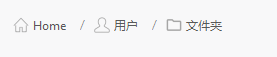

## 简介
`MBreadcrumb` 是一个自定义的面包屑导航组件，用于显示用户在层级结构中的当前位置，并允许用户返回到上层状态。面包屑导航通常用于文件系统、网站或其他具有层次结构的应用程序中。
******
## 初始化
  - `breadcrumb = MBreadcrumb()`
  - `breadcrumb = MBreadcrumb(separator="=>", parent=None) # 默认分隔符为"/"`
********
## 设置面包屑项
  - ```python
    data_list = [
            {'text': 'Home', "svg": "home_line.svg", 'clicked': lambda: print('Home')},
            {'text': '用户', "svg": "user_line.svg", 'clicked': lambda: print('User')},
            {'text': '文件夹', "svg": "folder_line.svg", 'clicked': lambda: print('Folder')}
        ]
    breadcrumb.set_item_list(data_list)
    ```
    - `text`：面包屑项的文本。
    - `svg`：面包屑项的图标。
    - `clicked`：点击面包屑项时执行的回调函数。
******
## 添加面包屑项
  - ```python
    data_dict = {"text": "New", "svg": "calendar_line.svg", 'clicked': lambda: print("New")}
    breadcrumb.add_item(data_dict)
    ```
********
## 示例代码

```python
import asyncio
import functools
from PySide2.QtWidgets import QWidget, QApplication, QVBoxLayout
from dayu_widgets.qt import MIcon
from qasync import QEventLoop
from dayu_widgets import MTheme, MPushButton, MBreadcrumb
class DemoWidget(QWidget):
    def __init__(self, parent=None):
        super(DemoWidget, self).__init__(parent)
        layout = QVBoxLayout()
        self.setLayout(layout)
        button_add = MPushButton(icon=MIcon("add_line.svg"))
        button_add.clicked.connect(functools.partial(self.add_breadcrumb))
        layout.addWidget(button_add)
        self.breadcrumb = MBreadcrumb()
        self.data_list = [
            {'text': 'Home', "svg": "home_line.svg", 'clicked': functools.partial(self.jump_breadcrumb, index=0)},
            {'text': '用户', "svg": "user_line.svg", 'clicked': functools.partial(self.jump_breadcrumb, index=1)},
            {'text': '文件夹', "svg": "folder_line.svg", 'clicked': functools.partial(self.jump_breadcrumb, index=2)}
        ]
        self.breadcrumb.set_item_list(self.data_list)
        layout.addWidget(self.breadcrumb)
    def add_breadcrumb(self):
        data_dict = {"text": "New", "svg": "calendar_line.svg", 'clicked': functools.partial(self.jump_breadcrumb, index=len(self.data_list))}
        self.data_list.append(data_dict)
        self.breadcrumb.add_item(data_dict)
    def jump_breadcrumb(self, index):
        self.data_list = self.data_list[:index+1]
        self.breadcrumb.set_item_list(self.data_list)
if __name__ == '__main__':
    # 创建主循环
    app = QApplication([])
    # 创建异步事件循环
    loop = QEventLoop(app)
    asyncio.set_event_loop(loop)
    # 创建窗口
    demo_widget = DemoWidget()
    MTheme().apply(demo_widget)
    # 显示窗口
    demo_widget.show()
    loop.run_forever()
