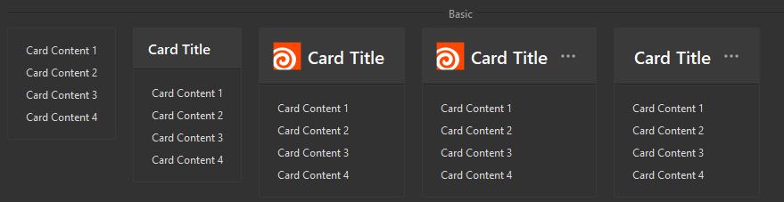

## 简介
`MCard` 是一个基于 `QWidget` 的自定义组件，用于创建卡片式用户界面元素。它支持标题、图像、大小调整以及额外的操作按钮。此组件适用于多种UI场景，如展示列表项或卡片式布局中的信息。

******
## 初始化
  - ```python
    card = MCard(title="示例卡片",
                 image=MPixmap("app-houdini.png"),
                 size=dayu_theme.large,
                 extra=True,
                 type=None,
                 parent=self)
    ```
    - `title`: 卡片标题文本。
    - `image`: 显示在标题左侧的小图标或头像路径。
    - `size`: 卡片大小，可选值为 dayu_theme.large, dayu_theme.medium, dayu_theme.small。
    - `extra`: 是否显示额外的操作按钮，默认为 None。
    - `type`: 目前未使用。
    - `parent`: 父级窗口对象。


********
## 设置卡片内容
  - `card.set_widget(MLabel("这是卡片的内容"))`


******
## 为卡片添加边框
  - `card = MCard(title="带边框的卡片").border()`


******
## 获取额外操作按钮的引用
  - `more_btn = card.get_more_button()`
******

## 示例代码

```python
import asyncio
from PySide2.QtWidgets import QWidget, QApplication, QVBoxLayout
from dayu_widgets.qt import MPixmap
from qasync import QEventLoop
from dayu_widgets import MTheme, MFieldMixin, MCard, MLabel, dayu_theme
class DemoWidget(QWidget, MFieldMixin):
    def __init__(self, parent=None):
        super(DemoWidget, self).__init__(parent)
        # 布局
        self.main_layout = QVBoxLayout()
        self.setLayout(self.main_layout)
        card = MCard(title="示例卡片",
                     image=MPixmap("app-houdini.png"),
                     size=dayu_theme.large,
                     extra=True,
                     type=None,
                     parent=self).border()
        for i in range(5):
            card.set_widget(MLabel(f"这是卡片的内容{i}"))
        more_btn = card.get_more_button()
        more_btn.clicked.connect(lambda: print("点击了更多按钮"))
        self.main_layout.addWidget(card)
if __name__ == '__main__':
    # 创建主循环
    app = QApplication([])
    # 创建异步事件循环
    loop = QEventLoop(app)
    asyncio.set_event_loop(loop)
    # 创建窗口
    demo_widget = DemoWidget()
    MTheme("dark").apply(demo_widget)
    # 显示窗口
    demo_widget.show()
    loop.run_forever()
```