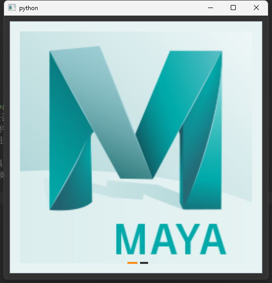

## 简介
`MCarousel` 图片轮播组件。支持自动播放、手动切换图片以及自定义间隔时间等功能，适用于多种应用场景。

******
## 初始化
  - ```python
    carousel = MCarousel(pix_list=[MPixmap('app-maya.png'), MPixmap('app-houdini.png')],  # 图片列表
                         autoplay=True,  # 是否自动切换
                         width=500,  # 轮播组件宽度，默认为500像素。
                         height=500,  # 轮播组件高度，默认为500像素。
                         parent=self)
    ```
********
## 设置切换间隔时间
  - `carousel.set_interval(ms=1000)  # 切换间隔（毫秒）`
******
## 设置是否自动切换
  - `carousel.set_autoplay(True)  # 是否自动切换`
******
## 手动切换图片
  - `carousel.next_page()  # 下一张`
  - `carousel.pre_page()  # 上一张`
  - `carousel.go_to_page(1)  # 跳转指定页`
******
## 示例代码

```python
import asyncio
from PySide2.QtWidgets import QWidget, QApplication, QVBoxLayout
from dayu_widgets.qt import MPixmap
from qasync import QEventLoop
from dayu_widgets import MTheme, MFieldMixin, MCarousel
class DemoWidget(QWidget, MFieldMixin):
    def __init__(self, parent=None):
        super(DemoWidget, self).__init__(parent)
        # 布局
        self.main_layout = QVBoxLayout()
        self.setLayout(self.main_layout)
        carousel = MCarousel(pix_list=[MPixmap('app-maya.png'), MPixmap('app-houdini.png')],  # 图片列表
                             autoplay=True,  # 是否自动切换
                             width=500,  # 轮播组件宽度，默认为500像素。
                             height=500,  # 轮播组件高度，默认为500像素。
                             parent=self)
        carousel.set_interval(ms=1000)  # 切换间隔（毫秒）
        carousel.set_autoplay(True)  # 是否自动切换
        carousel.next_page()  # 下一张
        carousel.pre_page()  # 上一张
        carousel.go_to_page(1)  # 跳转指定页
        self.main_layout.addWidget(carousel)
if __name__ == '__main__':
    # 创建主循环
    app = QApplication([])
    # 创建异步事件循环
    loop = QEventLoop(app)
    asyncio.set_event_loop(loop)
    # 创建窗口
    demo_widget = DemoWidget()
    MTheme("dark").apply(demo_widget)
    # 显示窗口
    demo_widget.show()
    loop.run_forever()
```