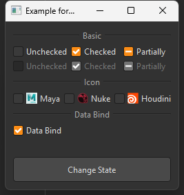

## 简介
`MCheckBox` 是一个自定义的复选框组件，提供了多种样式和功能，包括基本的复选框、带图标的复选框以及数据绑定功能。


******
## 初始化
  - `check_box = MCheckBox("A")`
********
## 设置三态模式(默认二态)
  - `check_box.setTristate(True)`
********
## 设置状态
  - `check_box.setChecked(True)  # 设置为选中状态`
  - `check_box.setCheckState(QtCore.Qt.Checked)  # 设置为选中状态`
  - `check_box.setCheckState(QtCore.Qt.Unchecked)  # 设置为未选中状态`
  - `check_box.setCheckState(QtCore.Qt.PartiallyChecked)  # 设置为半选中状态`
******
## 禁用复选框
  - `check_box.setEnabled(False)  # 禁用复选框`
******
## 设置图标
  - `check_box.setIcon(MIcon("app-maya.png"))`
******
## 是否选中
  - `check_box.isChecked()`
******
## 获取选中状态
  - `check_box.checkState() #返回一个 Qt.CheckState 枚举值`
    - `check_box.checkState() == QtCore.Qt.Checked # 未选中` 
    - `check_box.checkState() == QtCore.Qt.Unchecked # 部分选中（三态模式下的中间状态）` 
    - `check_box.checkState() == QtCore.Qt.PartiallyChecked # 完全选中` 
******
## 双向绑定
  - `widget_bind_value(parent=self, widget=self.checkBox, field_name="login_remember_me", widget_property="checked", widget_signal="toggled") # 二态`
  - `widget_bind_value(parent=self, widget=self.checkBox, field_name="login_remember_me", widget_property="tristate", widget_signal="stateChanged") # 三态`
******
## 示例代码

```python
import asyncio
from PySide2 import QtCore
from PySide2.QtWidgets import QWidget, QApplication, QVBoxLayout
from dayu_widgets.qt import MIcon
from qasync import QEventLoop
from dayu_widgets import MTheme, MCheckBox
class DemoWidget(QWidget):
    def __init__(self, parent=None):
        super(DemoWidget, self).__init__(parent)
        layout = QVBoxLayout()
        self.setLayout(layout)
        check_box1 = MCheckBox("A")
        # 设置为选中状态
        check_box1.setChecked(True)
        # 设置三态模式
        check_box1.setTristate(True)
        check_box2 = MCheckBox("B")
        state = check_box2.checkState()
        # 设置为选中状态
        check_box2.setCheckState(QtCore.Qt.Checked)
        check_box3 = MCheckBox("C")
        # 设置为未选中状态
        check_box3.setCheckState(QtCore.Qt.Unchecked)
        check_box4 = MCheckBox("D")
        # 设置为半选中状态
        check_box4.setCheckState(QtCore.Qt.PartiallyChecked)
        check_box5 = MCheckBox("E")
        # 禁用复选框
        check_box5.setEnabled(False)
        check_box6 = MCheckBox("F")
        check_box6.setIcon(MIcon("app-maya.png"))
        layout.addWidget(check_box1)
        layout.addWidget(check_box2)
        layout.addWidget(check_box3)
        layout.addWidget(check_box4)
        layout.addWidget(check_box5)
        layout.addWidget(check_box6)
        pass
if __name__ == '__main__':
    # 创建主循环
    app = QApplication([])
    # 创建异步事件循环
    loop = QEventLoop(app)
    asyncio.set_event_loop(loop)
    # 创建窗口
    demo_widget = DemoWidget()
    MTheme("dark").apply(demo_widget)
    # 显示窗口
    demo_widget.show()
    loop.run_forever()
