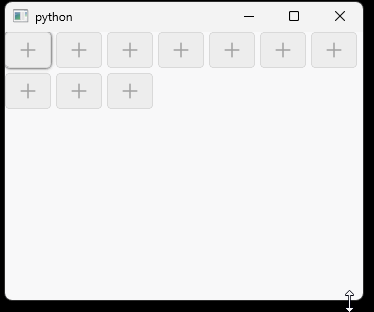

## 简介
`MCheckBox` 是一个自定义的复选框组件，提供了多种样式和功能，包括基本的复选框、带图标的复选框以及数据绑定功能。
******
## 初始化
  - `check_box = MCheckBox("A")`
********
## 设置三态模式(默认二态)
  - `check_box.setTristate(True)`
********
## 设置状态
  - `check_box.setChecked(True)  # 设置为选中状态`
  - `check_box.setCheckState(QtCore.Qt.Checked)  # 设置为选中状态`
  - `check_box.setCheckState(QtCore.Qt.Unchecked)  # 设置为未选中状态`
  - `check_box.setCheckState(QtCore.Qt.PartiallyChecked)  # 设置为半选中状态`
******
## 禁用复选框
  - `check_box.setEnabled(False)  # 禁用复选框`
******
## 设置图标
  - `check_box.setIcon(MIcon("app-maya.png"))`
******
## 数据绑定
  - `layout.takeAt(index)`
******
## 监听状态变化
  - `layout.count()`
******
## 示例代码

```python