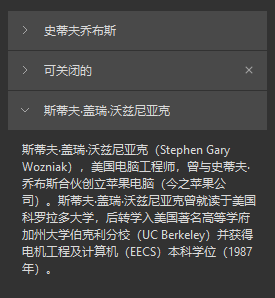

## 简介
`MCollapse` 和 `MSectionItem` 是用于创建折叠面板（collapse）和 可折叠的节（section）。这些组件支持标题、展开/折叠功能、关闭按钮以及内容区域。它们适用于多种 UI 场景，如配置面板、设置页面等


******
## 初始化
  - `collapse = MCollapse()`
********
## 添加数据
  - ```python
    collapse = MCollapse()
    label1 = MLabel("史蒂夫·乔布斯（Steve Jobs），1955年2月24日生于美国加利福尼亚州旧金山，")
    label1.setWordWrap(True)
    collapse.add_section({'title': '史蒂夫·乔布斯', 'widget': label1, 'expand': False, 'closable': True})
    ```
      - `title`: 折叠面板的标题，可以是字符串或控件
      - `widget`: 显示在折叠面板中的内容，可以是任何控件
      - `expand`: 是否默认展开，默认为 `True`
      - `closable`: 是否显示关闭按钮，默认为 `False`
******
## 批量添加数据
  - ```python
    sections = [
            {'title': '史蒂夫·乔布斯', 'widget': label1, 'expand': False, 'closable': True},
            {'title': '斯蒂夫·盖瑞·沃兹尼亚克', 'widget': label2, 'expand': False, 'closable': True},
            {'title': '乔纳森·伊夫', 'widget': label3, 'expand': False, 'closable': True}
    ]
    collapse.add_section_list(sections)
## 清空所有节
  - `collapse.clear()`
******
## 示例代码

```python
from Qt import QtWidgets
from dayu_widgets.collapse import MCollapse
from dayu_widgets.label import MLabel
class CollapseExample(QtWidgets.QWidget):
    def __init__(self, parent=None):
        super(CollapseExample, self).__init__(parent)
        self.setWindowTitle("Examples for MCollapse")
        self._init_ui()
    def _init_ui(self):
        label_1 = MLabel(
            "史蒂夫·乔布斯（Steve Jobs），1955年2月24日生于美国加利福尼亚州旧金山，美国发明家、企业家、美国苹果公司联合创办人。"
        )
        label_2 = MLabel(
            "斯蒂夫·盖瑞·沃兹尼亚克（Stephen Gary Wozniak），美国电脑工程师，曾与史蒂夫·乔布斯合伙创立苹果电脑（今之苹果公司）。斯蒂夫·盖瑞·沃兹尼亚克曾就读于美国科罗拉多大学，后转学入美国著名高等学府加州大学伯克利分校（UC Berkeley）并获得电机工程及计算机（EECS）本科学位（1987年）。"
        )
        label_3 = MLabel(
            "乔纳森·伊夫是一位工业设计师，现任Apple公司设计师兼资深副总裁，英国爵士。他曾参与设计了iPod，iMac，iPhone，iPad等众多苹果产品。除了乔布斯，他是对苹果那些著名的产品最有影响力的人。"
        )
        label_1.setWordWrap(True)
        label_2.setWordWrap(True)
        label_3.setWordWrap(True)
        section_list = [
            {"title": "史蒂夫乔布斯", "expand": True, "widget": label_1},
            {
                "title": "可关闭的",
                "expand": True,
                "widget": MLabel("This is a closable collapse item"),
                "closable": True,
            },
            {"title": "斯蒂夫·盖瑞·沃兹尼亚克", "expand": True, "widget": label_2},
        ]
        section_group = MCollapse()
        section_group.add_section_list(section_list)
        main_lay = QtWidgets.QVBoxLayout()
        main_lay.addWidget(section_group)
        main_lay.addStretch()
        self.setLayout(main_lay)
if __name__ == "__main__":
    from dayu_widgets import dayu_theme
    from dayu_widgets.qt import application

    with application() as app:
        test = CollapseExample()
        dayu_theme.apply(test)
        test.show()
