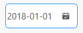

## 简介
`MDateEdit` 类继承自 `QDateEdit`，用于创建一个带有大小属性的日期选择器。

******
## 初始化
  - `date_edit = MDateEdit(date=QtCore.QDate.currentDate())`
    - `date`: 设置初始日期，当前日期 `QtCore.QDate.currentDate()`。
********
## 设置范围
  - `date_edit.setDateRange(QDate(2018, 1, 1), QDate(2018, 12, 31))`
******
## 设置值
  - `date_edit.setDate(QDate(2018, 1, 1))`
## 设置控件大小
  - `date_edit.huge()  # 设置为巨大尺寸`
  - `date_edit.large()  # 设置为大尺寸`
  - `date_edit.medium()  # 设置为中尺寸`
  - `date_edit.small()  # 设置为小尺寸`
  - `date_edit.tiny()  # 设置为微小尺寸`
******
## 是否显示日历
  - `date_edit.setCalendarPopup(True)`
******
## 设置显示格式
  - `date_edit.setDisplayFormat("yyyy-MM-dd")`
******
## 示例代码

```python
import asyncio
from PySide2.QtCore import QDate
from PySide2.QtWidgets import QWidget, QApplication, QVBoxLayout
from qasync import QEventLoop
from dayu_widgets import MTheme, MFieldMixin, MDateEdit
class DemoWidget(QWidget, MFieldMixin):
    def __init__(self, parent=None):
        super(DemoWidget, self).__init__(parent)
        self.setWindowTitle("MPushButton控件学习")
        # 布局
        self.main_layout = QVBoxLayout()
        self.setLayout(self.main_layout)
        date_edit = MDateEdit(date=QDate.currentDate()).large()
        date_edit.setDateRange(QDate(2018, 1, 1), QDate(2018, 12, 31))
        date_edit.setDate(QDate(2018, 1, 1))
        date_edit.setCalendarPopup(True)
        date_edit.setDisplayFormat("yyyy-MM-dd")
        self.main_layout.addWidget(date_edit)
if __name__ == '__main__':
    # 创建主循环
    app = QApplication([])
    # 创建异步事件循环
    loop = QEventLoop(app)
    asyncio.set_event_loop(loop)
    # 创建窗口
    demo_widget = DemoWidget()
    MTheme().apply(demo_widget)
    # 显示窗口
    demo_widget.show()
    loop.run_forever()