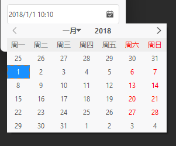

## 简介
`MDateTimeEdit` 类继承自 `QDateTimeEdit`，用于创建一个带有大小属性的日期时间选择器。

******
## 初始化
  - `date_time_edit = MDateTimeEdit(datetime=QtCore.QDateTime.currentDateTime())`
    - `datetime`: 设置初始日期时间，当前日期时间 `QtCore.QDateTime.currentDateTime()`。
********
## 设置范围
  - `date_time_edit.setDateRange(QDate(2018, 1, 1), QDate(2018, 12, 31))`
  - `date_time_edit.setTimeRange(QTime(10, 10, 10, 10), QTime(10, 10, 10, 10))`
******
## 设置值
  - `date_time_edit.setDate(QDate(2018, 1, 1))`
  - `date_time_edit.setTime(QTime(10, 10, 10, 10))`
******
## 设置显示格式
  - `date_time_edit.setDisplayFormat("yyyy-MM-dd HH:mm:ss")`
******
## 设置控件大小
  - `date_time_edit.huge()  # 设置为巨大尺寸`
  - `date_time_edit.large()  # 设置为大尺寸`
  - `date_time_edit.medium()  # 设置为中尺寸`
  - `date_time_edit.small()  # 设置为小尺寸`
  - `date_time_edit.tiny()  # 设置为微小尺寸`
******
******
## 是否显示日历
  - `date_time_edit.setCalendarPopup(True)`


******
## 示例代码

```python
import asyncio
from PySide2.QtCore import QDateTime, QDate, QTime
from PySide2.QtWidgets import QWidget, QApplication, QVBoxLayout
from qasync import QEventLoop
from dayu_widgets import MTheme, MFieldMixin, MDateTimeEdit
class DemoWidget(QWidget, MFieldMixin):
    def __init__(self, parent=None):
        super(DemoWidget, self).__init__(parent)
        self.setWindowTitle("MPushButton控件学习")
        # 布局
        self.main_layout = QVBoxLayout()
        self.setLayout(self.main_layout)
        date_time_edit = MDateTimeEdit(datetime=QDateTime.currentDateTime()).large()
        date_time_edit.setDateRange(QDate(2018, 1, 1), QDate(2018, 12, 31))
        date_time_edit.setTimeRange(QTime(10, 10, 10, 10), QTime(10, 10, 10, 10))
        date_time_edit.setDate(QDate(2018, 1, 1))
        date_time_edit.setTime(QTime(10, 10, 10, 10))
        date_time_edit.setCalendarPopup(True)
        date_time_edit.setDisplayFormat("yyyy-MM-dd HH:mm:ss")
        self.main_layout.addWidget(date_time_edit)
if __name__ == '__main__':
    # 创建主循环
    app = QApplication([])
    # 创建异步事件循环
    loop = QEventLoop(app)
    asyncio.set_event_loop(loop)
    # 创建窗口
    demo_widget = DemoWidget()
    MTheme().apply(demo_widget)
    # 显示窗口
    demo_widget.show()
    loop.run_forever()
