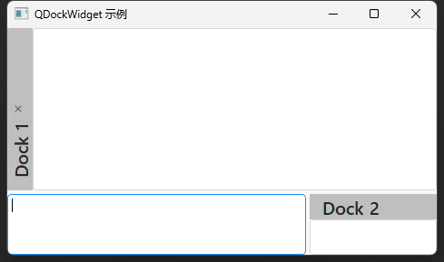

## 简介
`MDockWidget` 用于创建可停靠的窗口。嵌入到`主窗口`中，并且可以在不同的位置进行拖动和停靠。QDockWidget 通常用于创建工具栏、属性面板等辅助窗口。


******
## 创建停靠窗口
  - `self.dock1 = MDockWidget("Dock 1", self)`
  - `self.dock2 = MDockWidget("Dock 2", self)`
********
## 设置停靠窗口的内容控件
  - `self.dock1.setWidget(QTextEdit("这是 Dock 1"))`
  - `self.dock2.setWidget(QTextEdit("这是 Dock 2"))`
********
## 添加停靠窗口到主窗口
  - `self.dock1.setAllowedAreas(Qt.AllDockWidgetAreas)`
  - `self.dock2.setAllowedAreas(Qt.AllDockWidgetAreas)`
********
## 设置停靠窗口的特性
  - ```python
    self.dock1.setFeatures(
            QDockWidget.DockWidgetClosable  # 停靠窗口可关闭
            | QDockWidget.DockWidgetFloatable  # 可以从主窗口分离，作为独立窗口浮动
            | QDockWidget.DockWidgetMovable  # 可以移动到其他停靠区域
            | QDockWidget.DockWidgetVerticalTitleBar  # 停靠窗口标题栏为左侧垂直样式
        )
    self.dock2.setFeatures(
            # QDockWidget.AllDockWidgetFeatures  # 所有特性
            QDockWidget.NoDockWidgetFeatures  # 无特性。无法关闭、移动、浮动。
        )
    ```
********
## 示例代码

```python
import asyncio
from PySide2.QtGui import Qt
from PySide2.QtWidgets import QApplication, QMainWindow
from dayu_widgets import MTheme, MTextEdit
from dayu_widgets.dock_widget import MDockWidget
from qasync import QEventLoop
class StackedExample(QMainWindow):
    def __init__(self):
        super(StackedExample, self).__init__()
        # 创建主窗口
        self.setWindowTitle("QDockWidget 示例")

        # 创建文本编辑器作为中心控件
        self.text_edit = MTextEdit()
        self.setCentralWidget(self.text_edit)

        # 创建停靠窗口
        self.dock1 = MDockWidget("Dock 1", self)
        self.dock2 = MDockWidget("Dock 2", self)

        # 设置停靠窗口的内容控件
        self.dock1.setWidget(MTextEdit())
        self.dock2.setWidget(MTextEdit())

        # 添加停靠窗口到主窗口
        self.addDockWidget(Qt.LeftDockWidgetArea, self.dock1)
        self.addDockWidget(Qt.RightDockWidgetArea, self.dock2)

        # 设置允许停靠的区域
        self.dock1.setAllowedAreas(Qt.AllDockWidgetAreas)
        self.dock2.setAllowedAreas(Qt.AllDockWidgetAreas)

        # 设置停靠窗口的特性
        self.dock1.setFeatures(
            MDockWidget.DockWidgetClosable  # 停靠窗口可关闭
            | MDockWidget.DockWidgetFloatable  # 可以从主窗口分离，作为独立窗口浮动
            | MDockWidget.DockWidgetMovable  # 可以移动到其他停靠区域
            | MDockWidget.DockWidgetVerticalTitleBar  # 停靠窗口标题栏为左侧垂直样式
        )
        self.dock2.setFeatures(
            # QDockWidget.AllDockWidgetFeatures  # 所有特性
            MDockWidget.NoDockWidgetFeatures  # 无特性。无法关闭、移动、浮动。
        )
if __name__ == '__main__':
    # 创建主循环
    app = QApplication([])
    # 创建异步事件循环
    loop = QEventLoop(app)
    asyncio.set_event_loop(loop)
    # 创建窗口
    widget = StackedExample()
    MTheme().apply(widget)
    # 设置属性
    # 显示窗口
    widget.show()
    loop.run_forever()
```