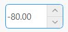

## 简介
`MDoubleSpinBox` 类继承自 `QDoubleSpinBox`，用于创建一个带有大小属性的浮点数输入框。

******
## 初始化
  - `double_spin_box = MDoubleSpinBox()`
********
## 设置范围
  - `double_spin_box.setRange(-100, 50)`
******
## 设置值
  - `double_spin_box.setValue(-80)`
******
## 设置控件大小
  - `double_spin_box.huge()  # 设置为巨大尺寸`
  - `double_spin_box.large()  # 设置为大尺寸`
  - `double_spin_box.medium()  # 设置为中尺寸`
  - `double_spin_box.small()  # 设置为小尺寸`
  - `double_spin_box.tiny()  # 设置为微小尺寸`
******
## 示例代码

```python
import asyncio
from PySide2.QtWidgets import QWidget, QApplication, QVBoxLayout
from qasync import QEventLoop
from dayu_widgets import MTheme, MFieldMixin, MDoubleSpinBox
class DemoWidget(QWidget, MFieldMixin):
    def __init__(self, parent=None):
        super(DemoWidget, self).__init__(parent)
        self.setWindowTitle("MPushButton控件学习")
        # 布局
        self.main_layout = QVBoxLayout()
        self.setLayout(self.main_layout)
        double_spin_box = MDoubleSpinBox().large()
        double_spin_box.setRange(-100, 50)
        double_spin_box.setValue(-80)
        self.main_layout.addWidget(double_spin_box)
if __name__ == '__main__':
    # 创建主循环
    app = QApplication([])
    # 创建异步事件循环
    loop = QEventLoop(app)
    asyncio.set_event_loop(loop)
    # 创建窗口
    demo_widget = DemoWidget()
    MTheme().apply(demo_widget)
    # 显示窗口
    demo_widget.show()
    loop.run_forever()
```