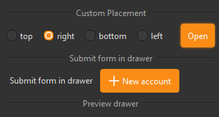
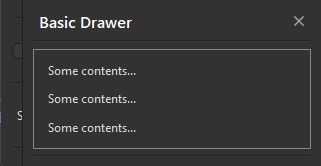
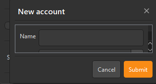

## 简介
`MDrawer` 用于创建从屏幕边缘滑出的面板。该组件支持四种位置：左（Left）、右（Right）、上（Top）、下（Bottom）。`MDrawer` 可以显示标题、内容，并且可以设置是否显示关闭按钮。


******
## 初始化
  - `drawer = MDrawer(title="Drawer Title", position="right", closable=True)`
    - `title`: 面板的标题。`
    - `position`: 面板的位置，可以是 "left"、"right"、"top" 或 "bottom"，默认为 "right"。
    - `closable`: 是否显示关闭按钮，默认为 True。
********
## 设置内容
  - ```python
    content_widget = QtWidgets.QLabel("This is the content of the drawer.")
    drawer.set_widget(content_widget)
    ```
******
## 添加按钮
  - ```python
    top_button = MToolButton().svg("info_line.svg").small()
    bottom_button = MToolButton().svg("warning_line.svg").small()

    drawer.add_widget_to_top(top_button) # 添加到顶部
    drawer.add_widget_to_bottom(bottom_button) # 添加到底部
    ```
******
## 设置位置
  - `drawer.set_dayu_position(MDrawer.LeftPos)`
******
## 显示面板
  - `drawer.show()`
******
## 关闭面板
  - `drawer.close()`
******
## 快捷方法
  - `left(): 设置为左位置。`
  - `right(): 设置为右位置。`
  - `top(): 设置为上位置。`
  - `bottom(): 设置为下位置。`
******
## 信号
  - `sig_closed: 面板关闭时发出的信号。`
******
## 属性
  - `dayu_position: 面板的位置`
******
## 示例代码

```python
from Qt import QtWidgets
from dayu_widgets.button_group import MRadioButtonGroup
from dayu_widgets.divider import MDivider
from dayu_widgets.drawer import MDrawer
from dayu_widgets.label import MLabel
from dayu_widgets.line_edit import MLineEdit
from dayu_widgets.push_button import MPushButton
from dayu_widgets.qt import MIcon
from dayu_widgets.qt import get_scale_factor
from dayu_widgets.spin_box import MDateEdit
from dayu_widgets.spin_box import MSpinBox
class DrawerExample(QtWidgets.QWidget):
    def __init__(self, parent=None):
        super(DrawerExample, self).__init__(parent)
        self.setWindowTitle("Examples for MDrawer")
        self._init_ui()
    def _init_ui(self):
        scale_x, _ = get_scale_factor()
        self.button_grp = MRadioButtonGroup()
        self.button_grp.set_button_list(
            ["top", {"text": "right", "checked": True}, "bottom", "left"]
        )
        open_button_2 = MPushButton("Open").primary()
        open_button_2.clicked.connect(self.slot_open_button_2)
        placement_lay = QtWidgets.QHBoxLayout()
        placement_lay.addWidget(self.button_grp)
        placement_lay.addSpacing(20 * scale_x)
        placement_lay.addWidget(open_button_2)
        placement_lay.addStretch()

        new_account_button = MPushButton(
            text="New account", icon=MIcon("add_line.svg", "#fff")
        ).primary()
        new_account_button.clicked.connect(self.slot_new_account)
        new_account_lay = QtWidgets.QHBoxLayout()
        new_account_lay.addWidget(MLabel("Submit form in drawer"))
        new_account_lay.addWidget(new_account_button)
        new_account_lay.addStretch()

        main_lay = QtWidgets.QVBoxLayout()
        main_lay.addWidget(MDivider("Custom Placement"))
        main_lay.addLayout(placement_lay)
        main_lay.addWidget(MDivider("Submit form in drawer"))
        main_lay.addLayout(new_account_lay)

        main_lay.addWidget(MDivider("Preview drawer"))
        self.setLayout(main_lay)
    def slot_open_button(self):
        custom_widget = QtWidgets.QWidget()
        custom_lay = QtWidgets.QVBoxLayout()
        custom_lay.addWidget(MLabel("Some contents..."))
        custom_lay.addWidget(MLabel("Some contents..."))
        custom_lay.addWidget(MLabel("Some contents..."))
        custom_widget.setLayout(custom_lay)

        drawer = MDrawer("Basic Drawer", parent=self).left()
        scale_x, _ = get_scale_factor()
        drawer.setFixedWidth(300 * scale_x)
        drawer.set_widget(custom_widget)
        drawer.show()
    def slot_open_button_2(self):
        custom_widget = QtWidgets.QWidget()
        custom_lay = QtWidgets.QVBoxLayout()
        custom_lay.addWidget(MLabel("Some contents..."))
        custom_lay.addWidget(MLabel("Some contents..."))
        custom_lay.addWidget(MLabel("Some contents..."))
        custom_widget.setLayout(custom_lay)

        drawer = MDrawer("Basic Drawer", parent=self)
        drawer.set_dayu_position(
            self.button_grp.get_button_group().checkedButton().text()
        )

        scale_x, _ = get_scale_factor()
        drawer.setFixedWidth(300 * scale_x)
        drawer.set_widget(custom_widget)
        drawer.show()
    def slot_new_account(self):
        custom_widget = QtWidgets.QWidget()
        custom_lay = QtWidgets.QFormLayout()
        custom_lay.addRow("Name", MLineEdit())
        custom_lay.addRow("Age", MSpinBox())
        custom_lay.addRow("Birth", MDateEdit())
        custom_widget.setLayout(custom_lay)

        drawer = MDrawer("New account", parent=self)
        submit_button = MPushButton("Submit").primary()
        submit_button.clicked.connect(drawer.close)
        drawer.add_widget_to_bottom(MPushButton("Cancel"))
        drawer.add_widget_to_bottom(submit_button)
        scale_x, _ = get_scale_factor()
        drawer.setFixedWidth(300 * scale_x)
        drawer.set_widget(custom_widget)
        drawer.show()
if __name__ == "__main__":
    # Import local modules
    from dayu_widgets import dayu_theme
    from dayu_widgets.qt import application

    with application() as app:
        test = DrawerExample()
        dayu_theme.apply(test)
        test.show()
```