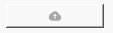
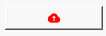
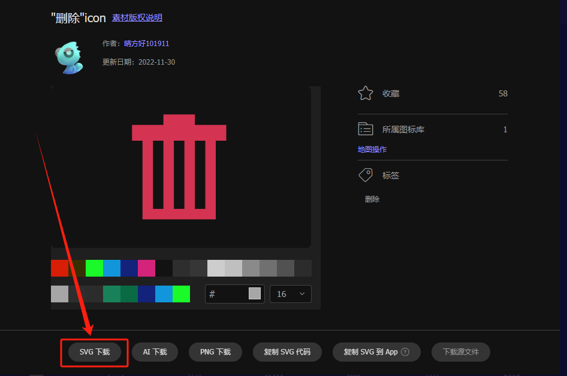
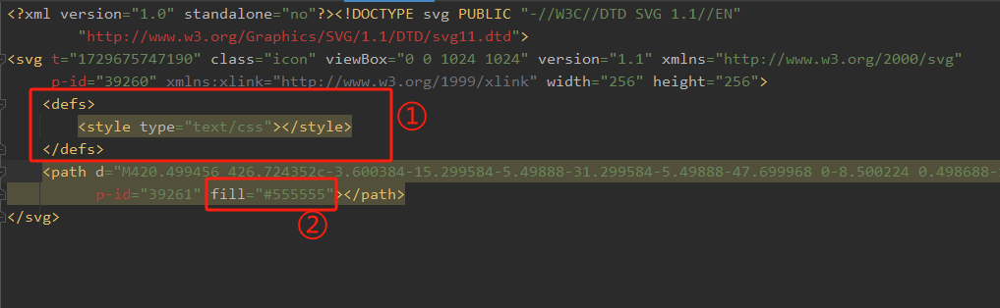

## 简介
`MIcon` 是一个用于高效加载和管理图标的工具类，支持 SVG 和其他常见图标格式。通过缓存机制减少重复加载相同图标时的性能开销，并且可以自定义图标的颜色。
******
## 基础图标
  - `MIcon('icon.svg')`
********
## 自定义颜色
  - `MIcon('icon.svg', color='#FF0000')`
******
## 自定义图标
  - [阿里巴巴适量图标库](https://www.iconfont.cn/)
  - 
  - 下载后，为了使他的颜色能够动态受控，需要将图标文件保存为SVG格式，并添加一个`<defs><style type="text/css"></style></defs>`标签，将颜色设置为`fill="#555555"`。
  - 
## 示例代码

```python
import asyncio
from PySide2.QtWidgets import QWidget, QApplication, QVBoxLayout, QPushButton
from dayu_widgets.qt import MIcon
from qasync import QEventLoop
from dayu_widgets import MTheme
class DemoWidget(QWidget):
    def __init__(self, parent=None):
        super(DemoWidget, self).__init__(parent)
        layout = QVBoxLayout(self)
        self.setLayout(layout)
        button1 = QPushButton()
        button2 = QPushButton()
        button1.setIcon(MIcon("cloud_fill.svg"))
        button2.setIcon(MIcon(path="cloud_fill.svg", color="red"))
        self.layout().addWidget(button1)
        self.layout().addWidget(button2)
if __name__ == '__main__':
    # 创建主循环
    app = QApplication([])

    # 创建异步事件循环
    loop = QEventLoop(app)
    asyncio.set_event_loop(loop)

    # 创建窗口
    demo_widget = DemoWidget()
    MTheme().apply(demo_widget)
    # 显示窗口
    demo_widget.show()

    loop.run_forever()
