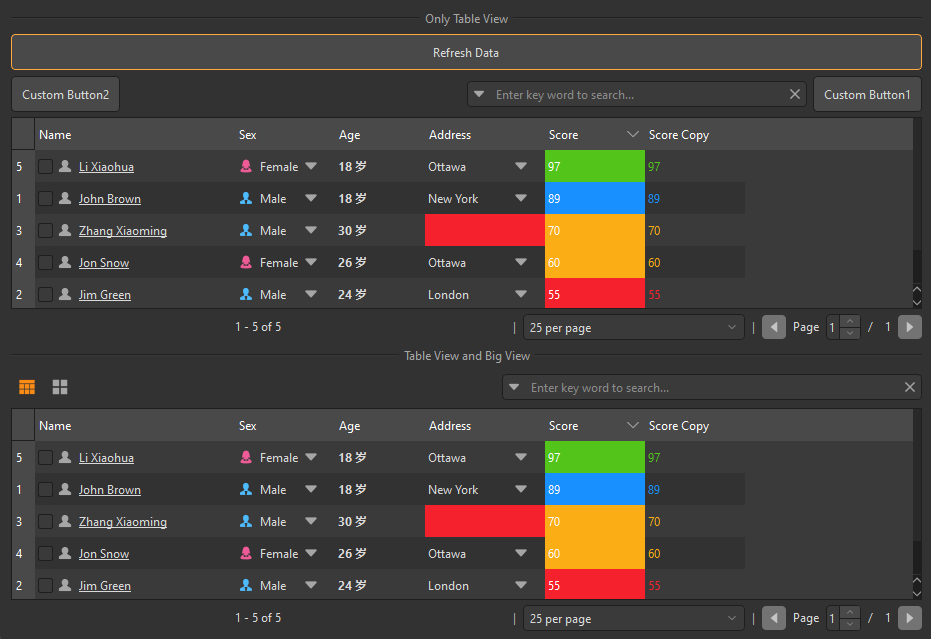

## 简介
`MItemViewFullSet` 是一个基于 QtWidgets.QWidget 的组件，集成了多种视图模式（表格视图和大视图）以及搜索、分页等功能。该组件适用于需要展示大量数据并支持多视图切换的场景。


******
## 初始化
  - `item_view = MItemViewFullSet(table_view=True, big_view=True)`
    - `table_view: 是否启用表格视图，默认为 True`。
    - `big_view: 是否启用大视图，默认为 True`。
********
## 视图切换
  - `item_view.view_button_grp.set_dayu_checked(0)  # 切换到表格视图`
  - `item_view.view_button_grp.set_dayu_checked(1)  # 切换到大视图`
******
## 启动上下文菜单
  - `item_view.enable_context_menu()`
******
## 分页功能
  - `item_view.set_record_count(len(data_list))`
******
## 搜索功能
  - `item_view.searchable()`
******
## 选择模式
  - `item_view.set_selection_mode(QtWidgets.QAbstractItemView.SingleSelection)`
******
## 工具栏可见性
  - `item_view.tool_bar_visible(True)  # 显示工具栏`
  - `item_view.tool_bar_visible(False)  # 隐藏工具栏`
******
## 获取数据
  - `current_data = item_view.get_data()`
******
## 自定义工具栏
  - ```python
    custom_button = QPushButton("Custom Button")
    item_view.tool_bar_append_widget(custom_button)  # 添加到工具栏末尾
    item_view.tool_bar_insert_widget(custom_button)  # 插入到工具栏开头
    ```
******
## 信号
  - `sig_double_clicked: 双击事件`
  - `sig_left_clicked: 单击事件`
  - `sig_current_changed: 当前项变化`
  - `sig_current_row_changed: 当前行变化`
  - `sig_current_column_changed: 当前列变化`
  - `sig_selection_changed: 选择变化`
  - `sig_context_menu: 上下文菜单事件`
******
## 示例代码

```python
from Qt import QtWidgets
from dayu_widgets import utils
from dayu_widgets.divider import MDivider
from dayu_widgets.field_mixin import MFieldMixin
from dayu_widgets.item_view_full_set import MItemViewFullSet
from dayu_widgets.push_button import MPushButton
import examples._mock_data as mock
@utils.add_settings("DaYu", "DaYuExample", event_name="hideEvent")
class ItemViewFullSetExample(QtWidgets.QWidget, MFieldMixin):
    def __init__(self, parent=None):
        super(ItemViewFullSetExample, self).__init__(parent)
        self._init_ui()
    def _init_ui(self):
        item_view_set_table = MItemViewFullSet()
        item_view_set_table.set_header_list(mock.header_list)
        item_view_set_table.tool_bar_visible(True)
        item_view_set_table.enable_context_menu()
        item_view_set_table.searchable()
        custom_button1 = MPushButton("Custom Button1")
        custom_button2 = MPushButton("Custom Button2")
        item_view_set_table.tool_bar_append_widget(custom_button1)  # 添加到工具栏末尾
        item_view_set_table.tool_bar_insert_widget(custom_button2)  # 插入到工具栏开头

        item_view_set_all = MItemViewFullSet(big_view=True)
        item_view_set_all.set_header_list(mock.header_list)
        item_view_set_all.tool_bar_visible(True)
        item_view_set_all.enable_context_menu()
        item_view_set_all.searchable()

        refresh_button = MPushButton("Refresh Data")
        refresh_button.clicked.connect(self.slot_update_data)
        main_lay = QtWidgets.QVBoxLayout()
        main_lay.addWidget(MDivider("Only Table View"))
        main_lay.addWidget(refresh_button)
        main_lay.addWidget(item_view_set_table)
        main_lay.addWidget(MDivider("Table View and Big View"))
        main_lay.addWidget(item_view_set_all)
        self.setLayout(main_lay)

        self.view_list = [
            item_view_set_table,
            item_view_set_all,
        ]
        self.bind(
            "item_view_full_set_example_header_state",
            item_view_set_table.table_view.header_view,
            "state",
        )
        self.slot_update_data()
    def slot_update_data(self):
        for view in self.view_list:
            view.setup_data(mock.data_list)
if __name__ == "__main__":
    # Import local modules
    from dayu_widgets import dayu_theme
    from dayu_widgets.qt import application
    with application() as app:
        test = ItemViewFullSetExample()
        dayu_theme.apply(test)
        test.show()