## 简介
`MLabel` 是一个增强版的 `QLabel` 控件，提供了多种样式和级别的标题显示功能。它支持不同的文本样式（如加粗、删除线、下划线等）以及不同级别的标题显示，并且可以根据窗口大小自动调整文本显示方式。
******
## 文本
  - `MLabel("Hello,World!")`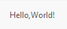
********
## 标题
  - `MLabel("Hello,World!").h1()`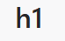
  - `MLabel("Hello,World!").h2()`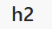
  - `MLabel("Hello,World!").h3()`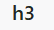
  - `MLabel("Hello,World!").h4()`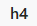
********
## 类型
  - `MLabel("Hello,World!").secondary()`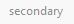
  - `MLabel("Hello,World!").warning()`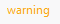
  - `MLabel("Hello,World!").danger()`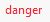
********
## 禁用
  - ```python
    labe = MLabel("Hello,World!")
    labe.setDisabled(True) # 设置为禁用类型
    ```
    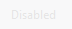
********
## 样式
  - `MLabel("Hello,World!").strong()  # 加粗`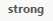
  - `MLabel("Hello,World!").mark()  # 标记`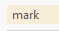
  - `MLabel("Hello,World!").code()  # 代码`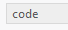
  - `MLabel("Hello,World!").delete()  # 删除线`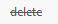
  - `MLabel("Hello,World!").underline()  # 下划线`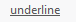
  - `MLabel("Hello,World!").h1().warning().strong().underline().delete()  # 标题+警告+加粗+下划线+删除线`
********
## 超链接
  - ```python
    label = MLabel()
    label.set_link(href="https://www.baidu.com")
    label = MLabel()
    label.set_link(href="https://www.baidu.com", text="百度一下,你就知道")
    ```
    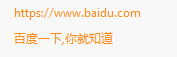
********
## 省略模式
  - 左省略
  ```python
  label = MLabel(text=text)
  label.set_elide_mode(Qt.ElideLeft)  # 左省略
  ```
  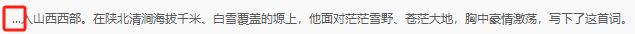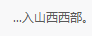
  - 中间省略
  ```python
  label = MLabel(text=text)
  label.set_elide_mode(Qt.ElideMiddle)  # 中间省略
  ```
  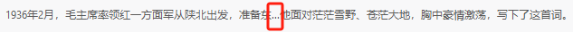
  - 右省略
  ```python
  label = MLabel(text=text)
  label.set_elide_mode(Qt.ElideRight)  # 右省略
  ```
  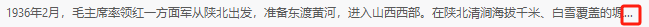
******
## 示例代码

```python
import asyncio

from PySide2.QtCore import Qt
from PySide2.QtWidgets import QWidget, QApplication, QVBoxLayout
from qasync import QEventLoop

from dayu_widgets import MTheme, MLabel, MFieldMixin


class DemoWidget(QWidget, MFieldMixin):
    def __init__(self, parent=None):
        super(DemoWidget, self).__init__(parent)
        layout = QVBoxLayout(self)
        self.setLayout(layout)

        # 文本显示
        label1 = MLabel("Hello,World!")
        self.layout().addWidget(label1)

        # 标题显示
        label2 = MLabel("h1").h1()
        label3 = MLabel("h2").h2()
        label4 = MLabel("h3").h3()
        label5 = MLabel("h4").h4()
        self.layout().addWidget(label2)
        self.layout().addWidget(label3)
        self.layout().addWidget(label4)
        self.layout().addWidget(label5)

        # 显示类型
        label6 = MLabel("secondary").secondary()  # 设置为次要类型
        label7 = MLabel("warning").warning()  # 设置为警告类型
        label8 = MLabel("danger").danger()  # 设置为危险类型
        label9 = MLabel("Disabled")
        label9.setDisabled(True)  # 设置为禁用类型
        self.layout().addWidget(label6)
        self.layout().addWidget(label7)
        self.layout().addWidget(label8)
        self.layout().addWidget(label9)

        # 样式
        label10 = MLabel("strong").strong()  # 加粗
        label11 = MLabel("mark").mark()  # 标记
        label12 = MLabel("code").code()  # 代码
        label13 = MLabel("delete").delete()  # 删除线
        label14 = MLabel("underline").underline()  # 下划线
        label15 = MLabel("Hello,World!").h1().warning().strong().underline().delete()  # 标题+警告+加粗+下划线+删除线
        self.layout().addWidget(label10)
        self.layout().addWidget(label11)
        self.layout().addWidget(label12)
        self.layout().addWidget(label13)
        self.layout().addWidget(label14)
        self.layout().addWidget(label15)

        # 超链接
        label16 = MLabel()
        label17 = MLabel()
        label16.set_link(href="https://www.baidu.com")
        label17.set_link(href="https://www.baidu.com", text="百度一下,你就知道")
        self.layout().addWidget(label16)
        self.layout().addWidget(label17)

        # 省略模式
        text = """1936年2月，毛主席率领红一方面军从陕北出发，准备东渡黄河，进入山西西部。在陕北清涧海拔千米、白雪覆盖的塬上，他面对茫茫雪野、苍茫大地，胸中豪情激荡，写下了这首词。"""
        label_left = MLabel(text=text)
        label_middle = MLabel(text=text)
        label_right = MLabel(text=text)
        label_left.set_elide_mode(Qt.ElideLeft)  # 左省略
        label_middle.set_elide_mode(Qt.ElideMiddle)  # 中间省略
        label_right.set_elide_mode(Qt.ElideRight)  # 右省略
        self.layout().addWidget(label_left)
        self.layout().addWidget(label_middle)
        self.layout().addWidget(label_right)


if __name__ == '__main__':
    # 创建主循环
    app = QApplication([])

    # 创建异步事件循环
    loop = QEventLoop(app)
    asyncio.set_event_loop(loop)

    # 创建窗口
    demo_widget = DemoWidget()
    MTheme().apply(demo_widget)
    # 显示窗口
    demo_widget.show()

    loop.run_forever()

```