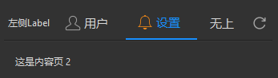
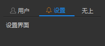

## 简介
MLineTabWidget 是用于创建带标签的堆叠窗口（stacked widget）。它支持水平对齐的标签按钮，并且可以根据不同的标签切换显示不同的内容页。此组件适用于多种 UI 场景，如导航栏、选项卡等。


******
## 初始化
  - `tab_center = MLineTabWidget(alignment=QtCore.Qt.AlignCenter)  # 标签按钮的对齐方式alignment`
********
## 设置头像
  - `avatar.set_dayu_image(MPixmap("app-nuke.png"))`
******
## 添加标签栏
  - `tab_center.add_tab(MLabel("用户界面"), {"text": "用户", "svg": "user_line.svg"})`
  - `tab_center.add_tab(MLabel("设置界面"), {"text": "设置", "svg": "alert_line.svg"})`
  - `tab_center.add_tab(MLabel("无上界面"), {"text": "无上"})`


******
## 设置控件大小
  - `tab_center.set_dayu_size(dayu_theme.large)`
******
## 设置当前打开的标签页
  - `tab_center.tool_button_group.set_dayu_checked(1)`
******
## 左侧插入控件
  - `tab_center.insert_widget(MLabel(text="左侧Label"))`
******
## 右侧插入控件
  - `tab_center.append_widget(MToolButton().svg("refresh_line.svg").icon_only())`
******
## 示例代码

```python
import asyncio
from PySide2 import QtCore
from PySide2.QtWidgets import QWidget, QApplication, QVBoxLayout, QScrollArea
from dayu_widgets.collapse import MSectionItem
from dayu_widgets.qt import MPixmap
from qasync import QEventLoop
from dayu_widgets import MTheme, MFieldMixin, MCard, MLabel, dayu_theme, MMeta, MCollapse, MLineTabWidget, MPushButton, \
    MToolButton
class DemoWidget(QWidget, MFieldMixin):
    def __init__(self, parent=None):
        super(DemoWidget, self).__init__(parent)
        # 布局
        self.main_layout = QVBoxLayout()
        self.setLayout(self.main_layout)
        # 创建内容页
        content_page1 = QWidget()
        content_page1_layout = QVBoxLayout()
        content_page1_layout.addWidget(MLabel("这是内容页 1"))
        content_page1.setLayout(content_page1_layout)

        content_page2 = QWidget()
        content_page2_layout = QVBoxLayout()
        content_page2_layout.addWidget(MLabel("这是内容页 2"))
        content_page2.setLayout(content_page2_layout)

        tab_center = MLineTabWidget(alignment=QtCore.Qt.AlignCenter)
        tab_center.set_dayu_size(dayu_theme.large)
        tab_center.add_tab(content_page1, {"text": "用户", "svg": "user_line.svg"})
        tab_center.add_tab(content_page2, {"text": "设置", "svg": "alert_line.svg"})
        tab_center.add_tab(MLabel("无上界面"), {"text": "无上"})
        tab_center.tool_button_group.set_dayu_checked(1)
        tab_center.append_widget(MToolButton().svg("refresh_line.svg").icon_only())
        tab_center.insert_widget(MLabel(text="左侧Label"))
        self.main_layout.addWidget(tab_center)
        self.main_layout.addStretch()
if __name__ == '__main__':
    # 创建主循环
    app = QApplication([])
    # 创建异步事件循环
    loop = QEventLoop(app)
    asyncio.set_event_loop(loop)
    # 创建窗口
    demo_widget = DemoWidget()
    MTheme("dark").apply(demo_widget)
    # 显示窗口
    demo_widget.show()
    loop.run_forever()
