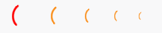

## 简介
`MLoading` 和 `MLoadingWrapper` 是两个用于显示加载动画的控件。`MLoading` 提供了一个旋转的加载动画图标，而 `MLoadingWrapper` 则在此基础上提供了一个包裹其他控件的容器，可以在需要时显示或隐藏加载动画。
********
## 基础用法
  - `MLoading()`
******** 
## 设置大小
  - `MLoading(size=50)`
********  
## 设置颜色
- `MLoading(color="blue")`
********
## 设置动画类型
- ```python
  huge_loading = MLoading.huge(color='red')  # 创建巨大的加载动画
  large_loading = MLoading.large()  # 创建大的加载动画
  medium_loading = MLoading.medium()  # 创建中等大小的加载动画
  small_loading = MLoading.small()  # 创建小的加载动画
  tiny_loading = MLoading.tiny()  # 创建极小的加载动画
  ```
  
********
## MLoadingWrapper包装器
  - 初始化
    - ```python
      MLoadingWrapper(widget=self.text_edit, loading=False, size=64, color=dayu_theme.red)
      ```
      - text_edit:被包裹的控件
      - loading:是否立即显示加载动画
      - size:加载动画的大小
      - color:加载动画的颜色
  - 显示/隐藏加载动画
    - ```python
      wrapper.set_dayu_loading(True) # 显示加载动画 
      wrapper.set_dayu_loading(False) # 隐藏加载动画
      ```
  - 获取加载状态
    - ```python
      is_loading = wrapper.dayu_loading # 获取当前是否正在加载
      ```
## 示例代码
```python
import asyncio
from PySide2.QtWidgets import QWidget, QApplication, QVBoxLayout, QPushButton, QTextEdit, QHBoxLayout
from qasync import QEventLoop, asyncSlot
from dayu_widgets import dayu_theme, MLoadingWrapper, MTheme, MLoading
class DemoWidget(QWidget):
    def __init__(self, parent=None):
        super(DemoWidget, self).__init__(parent)
        self.setWindowTitle("MLoading控件学习")
        # 布局
        self.main_layout = QVBoxLayout()
        self.setLayout(self.main_layout)

        huge_loading = MLoading.huge(color='red')  # 创建巨大的加载动画
        large_loading = MLoading.large()  # 创建大的加载动画
        medium_loading = MLoading.medium()  # 创建中等大小的加载动画
        small_loading = MLoading.small()  # 创建小的加载动画
        tiny_loading = MLoading.tiny()  # 创建极小的加载动画
        self.h_layout = QHBoxLayout()
        self.h_layout.addWidget(huge_loading)
        self.h_layout.addWidget(large_loading)
        self.h_layout.addWidget(medium_loading)
        self.h_layout.addWidget(small_loading)
        self.h_layout.addWidget(tiny_loading)
        self.main_layout.addLayout(self.h_layout)

        # 添加一个查询按钮
        self.button = QPushButton("查询数据", self)
        # 点击按钮，触发加载包装器的加载状态
        self.button.clicked.connect(self.btn_handle)
        self.main_layout.addWidget(self.button)

        # 添加一个文本框用来显示加载的数据
        self.text_edit = QTextEdit(self)
        self.main_layout.addWidget(self.text_edit)

        # 使用MLoadingWrapper加载包装器来包裹住文本框
        self.loading_wrapper = MLoadingWrapper(widget=self.text_edit, loading=False, size=64, color=dayu_theme.red)
        self.main_layout.addWidget(self.loading_wrapper)
    @asyncSlot()
    async def btn_handle(self):
        # 开启加载
        self.loading_wrapper.set_dayu_loading(True)
        # 模拟查询耗时1秒
        await asyncio.sleep(1)
        # 结束加载
        self.loading_wrapper.set_dayu_loading(False)
        # 渲染数据
        self.text_edit.setText(
            "陌生人并不在意你的梦想是什么，"
            "他们寻求满足自己的需要和欲望。"
            "在你介入没有明确需求、品牌或目的的生意时，"
            "风险将会累积。"
            "当你去做一项自己喜欢而不是需要去做的生意时，风险在累积。" * 2)
        pass
if __name__ == '__main__':
    # 创建主循环
    app = QApplication([])
    # 创建异步事件循环
    loop = QEventLoop(app)
    asyncio.set_event_loop(loop)
    # 创建窗口
    demo_widget = DemoWidget()
    MTheme(theme="light", primary_color=MTheme.yellow).apply(demo_widget)
    # 显示窗口
    demo_widget.show()
    loop.run_forever()
```
