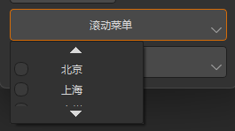

## 简介
`MMenu` 用于创建一个具有搜索功能的菜单系统。
******
## 初始化
  - `menu = MMenu(exclusive=True, cascader=False, parent=self) # 是否单选exclusive，是否级联cascader`
  - `menu.set_data(["上海", "北京", "深圳", "重庆", "广州", '成都']) # 设置菜单选项`
********
## 与MPushButton 结合使用
  - ```python
    menu = MMenu(exclusive=True, cascader=False, parent=self)
    menu.set_data(["上海", "北京", "深圳", "重庆", "广州", '成都'])
    button = MPushButton("请选择")
    button.setMenu(menu)
    ```
    
********
## 与MPushButton 结合使用(双向绑定)
  - ```python
    menu = MMenu(exclusive=False, cascader=False, parent=self)
    menu.set_data(["上海", "北京", "深圳", "重庆", "广州", '成都']) 
    button = MPushButton("请选择")
    button.setMenu(menu)
    # 双向绑定Menu选中值
    self.register_field("menu_selected", "上海")
    self.bind("menu_selected", menu, "value", signal="sig_value_changed")   
    # 使用计算属性显示值
    self.register_field("menu_selected_text", getter=functools.partial(lambda :" / ".join(self.field("menu_selected"))))
    self.bind("menu_selected_text", button, "text")
    ```
    
********
## 动态加载选项
  - `menu.set_load_callback(functools.partial(lambda: ["上海", "北京", "深圳", "重庆", "广州", '成都']))`
********
## 级联菜单(一)
  - ```python
    menu = MMenu(exclusive=True, cascader=True, parent=self)
    data = ["北京/故宫", "北京/天坛", "北京/王府井", "江苏/南京/夫子庙", "江苏/苏州/拙政园", "江苏/苏州/狮子林"]
    menu.set_data(data) 
    button = MPushButton("请选择")
    button.setMenu(menu)
    ```
    
********
## 级联菜单(二)
  - ```python
    menu = MMenu(exclusive=True, cascader=True, parent=self)
    data = [
        {'label': '北京', 'value': '北京', 'children': [{'label': '故宫', 'value': '故宫'}, {'label': '天坛', 'value': '天坛'}, {'label': '王府井', 'value': '王府井'}]},
        {'label': '江苏', 'value': '江苏', 'children': [{'label': '南京', 'value': '南京'}]}
    ]
    menu.set_data(data
    button = MPushButton("请选择")
    button.setMenu(menu)
    ```
********
## 支持滚动
  - `menu.setProperty("scrollable", True)  # 开启滚动菜单`
  - `menu.setProperty("max_scroll_count", 1)  # 设置触发滚动菜单的行数`


********
## 支持搜索
  - `menu.setProperty("searchable", True)`


********
## 图标项
  - `menu.addAction(MIcon("cloud_fill.svg"),"云南")`


********
## 完整示例
```python
from Qt import QtWidgets
from dayu_widgets.divider import MDivider
from dayu_widgets.field_mixin import MFieldMixin
from dayu_widgets.label import MLabel
from dayu_widgets.menu import MMenu
from dayu_widgets.push_button import MPushButton
class MenuExample(QtWidgets.QWidget, MFieldMixin):
    def __init__(self, parent=None):
        super(MenuExample, self).__init__(parent)
        self._init_ui()
    def _init_ui(self):
        self.register_field("button1_selected", "北京")
        self.register_field(
            "button1_selected_text", lambda: self.field("button1_selected")
        )
        button1 = MPushButton(text="Normal Menu")
        menu1 = MMenu(parent=self)
        menu1.set_data(["北京", "上海", "广州", "深圳"])
        button1.setMenu(menu1)
        button1.clicked.connect(button1.showMenu)
        label1 = MLabel()

        self.bind("button1_selected", menu1, "value", signal="sig_value_changed")
        self.bind("button1_selected_text", label1, "text")

        self.register_field("button2_selected", ["北京"])
        self.register_field(
            "button2_selected_text", lambda: ", ".join(self.field("button2_selected"))
        )
        button2 = MPushButton(text="Multi Select Menu")
        menu2 = MMenu(exclusive=False, parent=self)
        menu2.set_data(["北京", "上海", "广州", "深圳"])
        button2.setMenu(menu2)
        button2.clicked.connect(button2.showMenu)
        label2 = MLabel()
        self.bind("button2_selected", menu2, "value", signal="sig_value_changed")
        self.bind("button2_selected_text", label2, "text")

        self.register_field("button3_selected", "")
        self.register_field(
            "button3_selected_text", lambda: self.field("button3_selected")
        )
        button3 = MPushButton(text="回调函数获取选项")
        menu3 = MMenu(parent=self)
        menu3.set_load_callback(lambda: ["北京", "上海", "广州", "深圳"])
        button3.setMenu(menu3)
        button3.clicked.connect(button2.showMenu)
        label3 = MLabel()
        self.bind("button3_selected", menu3, "value", signal="sig_value_changed")
        self.bind("button3_selected_text", label3, "text")

        self.register_field("button4_selected", "")
        self.register_field(
            "button4_selected_text", lambda: " / ".join(self.field("button4_selected"))
        )
        button4 = MPushButton(text="级联选择")
        menu4 = MMenu(exclusive=True, cascader=True, title="", parent=self)
        menu4.set_data(
            ["北京/故宫", "北京/天坛", "北京/王府井", "江苏/南京/夫子庙", "江苏/苏州/拙政园", "江苏/苏州/狮子林"]
        )
        button4.setMenu(menu4)
        button4.clicked.connect(button4.showMenu)
        label4 = MLabel()
        self.bind("button4_selected", menu4, "value", signal="sig_value_changed")
        self.bind("button4_selected_text", label4, "text")

        sub_lay1 = QtWidgets.QHBoxLayout()
        sub_lay1.addWidget(button1)
        sub_lay1.addWidget(label1)
        sub_lay2 = QtWidgets.QHBoxLayout()
        sub_lay2.addWidget(button2)
        sub_lay2.addWidget(label2)
        sub_lay3 = QtWidgets.QHBoxLayout()
        sub_lay3.addWidget(button3)
        sub_lay3.addWidget(label3)
        sub_lay4 = QtWidgets.QHBoxLayout()
        sub_lay4.addWidget(button4)
        sub_lay4.addWidget(label4)

        sub_lay5 = QtWidgets.QHBoxLayout()
        button = MPushButton(text="滚动菜单")
        menu = MMenu(parent=self)
        items = ["北京", "上海", "广州", "深圳", "北戴河", "BBC/data", "BBC/hello", "American"]
        menu.set_data(items)
        menu.addAction(MIcon("cloud_fill.svg"), "位置")
        menu.setProperty("max_scroll_count", 1)  # 设置触发滚动菜单的行数
        menu.setProperty("scrollable", True)  # 开启滚动菜单
        menu.setProperty("searchable", True)  # 开启搜索菜单
        button.setMenu(menu)
        sub_lay5.addWidget(button)

        sub_lay6 = QtWidgets.QHBoxLayout()
        button = MPushButton(text="搜索菜单")
        menu = MMenu(parent=self)
        items = ["北京", "上海", "广州", "深圳", "北戴河"]
        for item in items:
            menu.addAction(item)
        sub_menu = MMenu(parent=self, title="BBC")
        for item in ["data", "hello"]:
            _menu = MMenu(parent=self, title=item)
            _menu.addAction("tencent")
            _menu.addAction("baidu")
            _menu.addAction("google")
            _menu.setProperty("searchable", True)
            sub_menu.addMenu(_menu)
        menu.addMenu(sub_menu)
        menu.setProperty("searchable", True)
        button.setMenu(menu)
        sub_lay6.addWidget(button)

        main_lay = QtWidgets.QVBoxLayout()
        main_lay.addWidget(MDivider("Select"))
        main_lay.addLayout(sub_lay1)
        main_lay.addLayout(sub_lay2)
        main_lay.addLayout(sub_lay3)
        main_lay.addWidget(MDivider("级联选择"))
        main_lay.addLayout(sub_lay4)
        main_lay.addLayout(sub_lay5)
        main_lay.addLayout(sub_lay6)
        main_lay.addStretch()
        self.setLayout(main_lay)
if __name__ == "__main__":
    # Import local modules
    from dayu_widgets import dayu_theme
    from dayu_widgets.qt import application, MIcon
    with application() as app:
        test = MenuExample()
        dayu_theme.apply(test)
        test.show()
