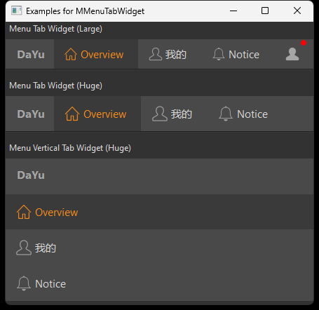

## 简介
`MMenuTabWidget` 是一个自定义的导航菜单组件，用于显示一组可切换的选项卡或菜单项。它支持水平和垂直布局，并提供了添加菜单项、设置大小等功能。
******
## 初始化
  - `menu_tab_widget = MMenuTabWidget(orientation=QtCore.Qt.Horizontal)  # orientation导航组件方向`
********
## 设置菜单大小
  - `menu_tab_widget.set_dayu_size(dayu_theme.medium:int)`
******
## 添加菜单项
  - ```python
    data_dict = {
            "text": "Home",
            "svg": "home_line.svg",
            "tooltip": "Go to home page",
            "clicked": lambda: print("Home")
        }
    # 添加导航菜单项
    menu_tab_widget.add_menu(data_dict, 0)
    ```
    - `text`: 菜单项文本
    - `svg`: 菜单项图标
    - `tooltip`: 菜单项提示信息
    - `clicked`: 点击事件
******
## 在导航栏头部添加控件
  - `menu_tab_widget.tool_bar_insert_widget(MLabel("DY"))`
******
## 在导航栏尾部添加控件
  - `menu_tab_widget.tool_bar_append_widget(MLabel("YZ").strong())`
******
## 设置当前选中的菜单项 ID
  - `menu_tab_widget.tool_button_group.set_dayu_checked(0)`
******
## 获取当前选中的菜单项 ID
  - `checked = menu_tab_widget.tool_button_group.get_dayu_checked()`
******
## 示例代码

```python
import asyncio
from PySide2 import QtCore
from PySide2.QtWidgets import QWidget, QApplication, QVBoxLayout
from qasync import QEventLoop
from dayu_widgets import MTheme, MMenuTabWidget, dayu_theme, MLabel
class DemoWidget(QWidget):
    def __init__(self, parent=None):
        super(DemoWidget, self).__init__(parent)
        layout = QVBoxLayout()
        self.setLayout(layout)
        menu_tab_widget = MMenuTabWidget(orientation=QtCore.Qt.Horizontal)  # orientation导航组件方向
        data_dict = {
            "text": "Home",
            "svg": "home_line.svg",
            "tooltip": "Go to home page",
            "clicked": lambda: print("Home")
        }
        # 添加导航菜单项及其ID
        menu_tab_widget.add_menu(data_dict, 0)
        # 设置菜单大小
        menu_tab_widget.set_dayu_size(dayu_theme.medium)
        # 在导航菜单的头部插入控件
        menu_tab_widget.tool_bar_insert_widget(MLabel("DY"))
        # 在导航菜单的尾部插入控件
        menu_tab_widget.tool_bar_append_widget(MLabel("YZ").strong())
        # 设置当前选中的菜单项 ID
        menu_tab_widget.tool_button_group.set_dayu_checked(0)
        # 获取当前选中的菜单项 ID
        checked = menu_tab_widget.tool_button_group.get_dayu_checked()
        layout.addWidget(menu_tab_widget)
if __name__ == '__main__':
    # 创建主循环
    app = QApplication([])
    # 创建异步事件循环
    loop = QEventLoop(app)
    asyncio.set_event_loop(loop)
    # 创建窗口
    demo_widget = DemoWidget()
    MTheme().apply(demo_widget)
    # 显示窗口
    demo_widget.show()
    loop.run_forever()
