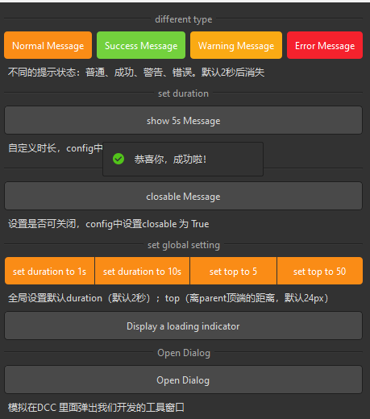

## 简介
`MMessage` 用于显示全局消息，作为用户操作的反馈。该组件支持五种类型的消息：信息（`Info`）、成功（`Success`）、警告（`Warning`）、错误（`Error`）和加载（`Loading`）。`MMessage` 可以显示文本内容，并且可以设置是否显示关闭按钮。


******
## 基本用法
  - `message = MMessage(text="This is a message.", duration=2, dayu_type=MMessage.InfoType, closable=True, parent=None)`
    - `text: 消息的文本内容.`
    - `duration: 消息显示的时间（秒），默认为 2 秒`
    - `dayu_type: 消息的类型，可以是 MMessage.InfoType、MMessage.SuccessType、MMessage.WarningType、MMessage.ErrorType 或 MMessage.LoadingType，默认为 MMessage.InfoType`
    - `closable: 是否显示关闭按钮，默认为 False`
********
## 显示消息
  - `message.show()`
******
## 关闭消息
  - `message.close()`
******
## 快捷方法
  - `MMessage.info("This is an info message.", parent=your_parent_widget)`
    - `info(text, parent, duration=None, closable=None): 显示信息消息`
    - `success(text, parent, duration=None, closable=None): 显示成功消息`
    - `warning(text, parent, duration=None, closable=None): 显示警告消息`
    - `error(text, parent, duration=None, closable=None): 显示错误消息`
    - `loading(text, parent): 显示加载消息。`
******
## 全局配置
  - `MMessage.config(duration=3, top=30)`
    - `duration: 消息显示的时间（秒），默认为 2 秒`
    - `top: 消息距离顶部的距离（像素），默认为 24 像素。`
******
## 设置是否显示关闭按钮
  - `alert.set_closable(True)`
******
## 快捷方法
  - `alert.info().closable()`
    - info(): 设置为信息类型。
    - success(): 设置为成功类型。
    - warning(): 设置为警告类型。
    - error(): 设置为错误类型。
    - closable(): 设置为可关闭。
******
## 信号
  - `sig_closed: 消息关闭时发出的信号。`
******
## 属性
  - `default_config: 全局配置，包括 duration 和 top`
******
## 示例代码

```python
import functools
from Qt import QtWidgets
from dayu_widgets.button_group import MPushButtonGroup
from dayu_widgets.divider import MDivider
from dayu_widgets.field_mixin import MFieldMixin
from dayu_widgets.label import MLabel
from dayu_widgets.message import MMessage
from dayu_widgets.push_button import MPushButton
class MDialogExample(QtWidgets.QDialog):
    def __init__(self, parent=None):
        super(MDialogExample, self).__init__(parent=parent)
        main_lay = QtWidgets.QVBoxLayout()
        button = MPushButton("Show Message")
        button.clicked.connect(self.slot_show_message)

        main_lay.addWidget(MLabel("This is a dialog in DCC. Click the button to show a message."))
        main_lay.addWidget(button)
        self.setLayout(main_lay)
    def slot_show_message(self):
        MMessage.info(parent=self, text="This is a message")
class MessageExample(QtWidgets.QWidget, MFieldMixin):
    def __init__(self, parent=None):
        super(MessageExample, self).__init__(parent)
        self.setWindowTitle("Examples for MMessage")
        self._init_ui()
    def _init_ui(self):
        button3 = MPushButton(text="Normal Message").primary()
        button4 = MPushButton(text="Success Message").success()
        button5 = MPushButton(text="Warning Message").warning()
        button6 = MPushButton(text="Error Message").danger()
        button3.clicked.connect(
            functools.partial(
                self.slot_show_message, MMessage.info, {"text": "这是一条普通提示"}
            )
        )
        button4.clicked.connect(
            functools.partial(
                self.slot_show_message, MMessage.success, {"text": "恭喜你，成功啦！"}
            )
        )
        button5.clicked.connect(
            functools.partial(
                self.slot_show_message, MMessage.warning, {"text": "我警告你哦！"}
            )
        )
        button6.clicked.connect(
            functools.partial(self.slot_show_message, MMessage.error, {"text": "失败了！"})
        )

        sub_lay1 = QtWidgets.QHBoxLayout()
        sub_lay1.addWidget(button3)
        sub_lay1.addWidget(button4)
        sub_lay1.addWidget(button5)
        sub_lay1.addWidget(button6)

        button_duration = MPushButton(text="show 5s Message")
        button_duration.clicked.connect(
            functools.partial(
                self.slot_show_message,
                MMessage.info,
                {"text": "该条消息将显示5秒后关闭", "duration": 5},
            )
        )
        button_closable = MPushButton(text="closable Message")
        button_closable.clicked.connect(
            functools.partial(
                self.slot_show_message,
                MMessage.info,
                {"text": "可手动关闭提示", "closable": True},
            )
        )
        main_lay = QtWidgets.QVBoxLayout()
        main_lay.addWidget(MDivider("different type"))
        main_lay.addLayout(sub_lay1)
        main_lay.addWidget(MLabel("不同的提示状态：普通、成功、警告、错误。默认2秒后消失"))
        main_lay.addWidget(MDivider("set duration"))
        main_lay.addWidget(button_duration)
        main_lay.addWidget(MLabel("自定义时长，config中设置duration值，单位为秒"))

        main_lay.addWidget(MDivider("set closable"))
        main_lay.addWidget(button_closable)
        main_lay.addWidget(MLabel("设置是否可关闭，config中设置closable 为 True"))

        button_grp = MPushButtonGroup()
        button_grp.set_button_list(
            [
                {
                    "text": "set duration to 1s",
                    "clicked": functools.partial(
                        self.slot_set_config, MMessage.config, {"duration": 1}
                    ),
                },
                {
                    "text": "set duration to 10s",
                    "clicked": functools.partial(
                        self.slot_set_config, MMessage.config, {"duration": 10}
                    ),
                },
                {
                    "text": "set top to 5",
                    "clicked": functools.partial(
                        self.slot_set_config, MMessage.config, {"top": 5}
                    ),
                },
                {
                    "text": "set top to 50",
                    "clicked": functools.partial(
                        self.slot_set_config, MMessage.config, {"top": 50}
                    ),
                },
            ]
        )
        loading_button = MPushButton("Display a loading indicator")
        loading_button.clicked.connect(self.slot_show_loading)
        main_lay.addWidget(MDivider("set global setting"))
        main_lay.addWidget(button_grp)
        main_lay.addWidget(MLabel("全局设置默认duration（默认2秒）；top（离parent顶端的距离，默认24px）"))
        main_lay.addWidget(loading_button)

        main_lay.addWidget(MDivider("Open Dialog"))
        button_open_dialog = MPushButton("Open Dialog")
        button_open_dialog.clicked.connect(self.slot_open_dialog)
        main_lay.addWidget(button_open_dialog)
        main_lay.addWidget(MLabel("模拟在DCC 里面弹出我们开发的工具窗口"))

        main_lay.addStretch()
        self.setLayout(main_lay)
    def slot_show_message(self, func, config):
        func(parent=self, **config)
    def slot_set_config(self, func, config):
        func(**config)
    def slot_show_loading(self):
        msg = MMessage.loading("正在加载中", parent=self)
        msg.sig_closed.connect(functools.partial(MMessage.success, "加载成功啦！！哈哈哈哈", self))
    def slot_open_dialog(self):
        dialog = MDialogExample(self)
        dialog.exec_()
if __name__ == "__main__":
    from dayu_widgets import dayu_theme
    from dayu_widgets.qt import application
    with application() as app:
        test = MessageExample()
        dayu_theme.apply(test)
        test.show()
```