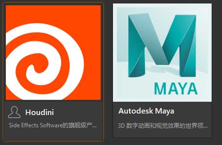
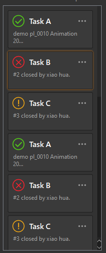

## 简介
`MMeta` 用于创建元数据（metadata）卡片式用户界面元素。它支持封面图片、头像、标题、描述和额外的操作按钮。此组件适用于多种 UI 场景，如展示列表项或卡片式布局中的信息。



******
## 初始化
  - `meta_card = MMeta(extra=False)  # 是否显示额外操作按钮extra`
********
## 设置卡片的数据
  - ```python
    meta_card.setup_data({
            'cover': MPixmap("app-houdini.png"),  # 封面图片路径
            'avatar': MPixmap("user_line.svg"),  # 头像图片路径
            'title': 'Houdini',  # 标题文本
            'description': 'Side Effects Software的旗舰级产品，是创建高级视觉效果的有效工具',  # 描述文本
    })
******
## 获取额外操作按钮的引用
  - `more_btn = meta_card.get_more_button()`
******

## 示例代码

```python
from Qt import QtWidgets
from dayu_widgets.card import MCard
from dayu_widgets.card import MMeta
from dayu_widgets.divider import MDivider
from dayu_widgets.flow_layout import MFlowLayout
from dayu_widgets.label import MLabel
from dayu_widgets.qt import MPixmap
class CardExample(QtWidgets.QWidget):
    def __init__(self, parent=None):
        super(CardExample, self).__init__(parent)
        self.setWindowTitle("Examples for MCard")
        geo = QtWidgets.QApplication.desktop().screenGeometry()
        width = float(geo.width())
        height = float(geo.height())
        x = int(width / 4)
        y = int(height / 4)
        w = int(width / 1.5)
        h = int(height / 2)
        self.setGeometry(x, y, w, h)
        self._init_ui()
    def _init_ui(self):
        basic_card_lay = MFlowLayout()
        basic_card_lay.setSpacing(20)
        for setting in [
            {
                "title": "",
            },
            {"title": "Card Title", "size": dayu_theme.small},
            {"title": "Card Title", "image": MPixmap("app-houdini.png")},
            {
                "title": "Card Title",
                "extra": "More",
                "image": MPixmap("app-houdini.png"),
            },
            {
                "title": "Card Title",
                "extra": "More",
            },
        ]:
            card_0 = MCard(**setting)
            content_widget_0 = QtWidgets.QWidget()
            content_lay_0 = QtWidgets.QVBoxLayout()
            content_lay_0.setContentsMargins(15, 15, 15, 15)
            content_widget_0.setLayout(content_lay_0)
            for i in range(4):
                content_lay_0.addWidget(MLabel("Card Content {}".format(i + 1)))
            card_0.set_widget(content_widget_0)

            basic_card_lay.addWidget(card_0)

        meta_card_lay = MFlowLayout()
        meta_card_lay.setSpacing(20)
        for setting in [
            {
                "title": "Houdini",
                "description": "Side Effects Software的旗舰级产品，是创建高级视觉效果的有效工具",
                "avatar": MPixmap("user_line.svg"),
                "cover": MPixmap("app-houdini.png"),
            },
            {
                "title": "Autodesk Maya",
                "description": "3D 数字动画和视觉效果的世界领先软件应用程序",
                "cover": MPixmap("app-maya.png"),
            },
        ]:
            meta_card = MMeta()
            meta_card.setup_data(setting)
            meta_card_lay.addWidget(meta_card)

        task_card_lay = QtWidgets.QVBoxLayout()
        # task_card_lay.setSpacing(10)
        for setting in [
            {
                "title": "Task A",
                "description": "demo pl_0010 Animation \n2019/04/01 - 2019/04/09",
                "avatar": MPixmap("success_line.svg", dayu_theme.success_color),
            },
            {
                "title": "Task B",
                "description": "#2 closed by xiao hua.",
                "avatar": MPixmap("error_line.svg", dayu_theme.error_color),
            },
            {
                "title": "Task C",
                "description": "#3 closed by xiao hua.",
                "avatar": MPixmap("warning_line.svg", dayu_theme.warning_color),
            },
        ] * 5:
            meta_card = MMeta(extra=True)
            meta_card.setup_data(setting)
            task_card_lay.addWidget(meta_card)

        left_lay = QtWidgets.QVBoxLayout()
        left_lay.addWidget(MDivider("Basic"))
        left_lay.addLayout(basic_card_lay)
        left_lay.addWidget(MDivider("Meta E-Commerce Example"))
        left_lay.addLayout(meta_card_lay)
        left_lay.addStretch()
        left_widget = QtWidgets.QWidget()
        left_widget.setLayout(left_lay)

        right_lay = QtWidgets.QVBoxLayout()
        right_lay.addWidget(MDivider("Meta Task Item Example"))
        scroll = QtWidgets.QScrollArea()
        scroll.setWidgetResizable(True)
        task_widget = QtWidgets.QWidget()
        task_widget.setLayout(task_card_lay)
        scroll.setWidget(task_widget)

        right_lay.addWidget(scroll)
        right_widget = QtWidgets.QWidget()
        right_widget.setLayout(right_lay)

        splitter = QtWidgets.QSplitter()
        splitter.addWidget(left_widget)
        splitter.addWidget(right_widget)
        splitter.setStretchFactor(0, 80)
        splitter.setStretchFactor(1, 20)
        main_lay = QtWidgets.QVBoxLayout()
        main_lay.addWidget(splitter)
        self.setLayout(main_lay)
if __name__ == "__main__":
    from dayu_widgets import dayu_theme
    from dayu_widgets.qt import application
    with application() as app:
        test = CardExample()
        dayu_theme.apply(test)
        test.show()
```