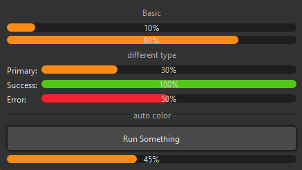

## 简介
MProgressBar 是一个基于 QtWidgets.QProgressBar 的自定义进度条组件，支持三种状态：正常（Normal）、错误（Error）和成功（Success）。该组件可以根据进度值自动调整颜色，并提供了便捷的方法来设置和获取状态。


******
## 基本用法
  - `progress_bar = MProgressBar(parent=None)`
********
## 设置状态
  - `progress_bar.set_dayu_status(MProgressBar.NormalStatus) # 正常状态。`
  - `progress_bar.set_dayu_status(MProgressBar.ErrorStatus) # 错误状态。`
  - `progress_bar.set_dayu_status(MProgressBar.SuccessStatus) # 成功状态。`
  - `progress_bar.normal()`
  - `progress_bar.error()`
  - `progress_bar.success()`
******
## 自动更新颜色
可以通过 auto_color 方法使进度条根据进度值自动更新颜色：
  - `progress_bar.auto_color()`
******
## 获取状态
  - `current_status = progress_bar.get_dayu_status()`
******
## 属性
  - `dayu_status: 当前状态的属性。`
******
## 信号
  - `valueChanged: 进度值发生变化时发出的信号。`
******
## 示例代码

```python
from Qt import QtCore
from Qt import QtWidgets
from dayu_widgets.divider import MDivider
from dayu_widgets.field_mixin import MFieldMixin
from dayu_widgets.progress_bar import MProgressBar
from dayu_widgets.push_button import MPushButton
class ProgressBarExample(QtWidgets.QWidget, MFieldMixin):
    def __init__(self, parent=None):
        super(ProgressBarExample, self).__init__(parent)
        self.setWindowTitle("Examples for MProgressBar")
        self._init_ui()
    def _init_ui(self):
        progress_1 = MProgressBar()
        progress_1.setValue(10)
        progress_1.setAlignment(QtCore.Qt.AlignCenter)
        progress_2 = MProgressBar()
        progress_2.setValue(80)

        progress_normal = MProgressBar()
        progress_normal.setValue(30)
        progress_success = MProgressBar().success()
        progress_success.setValue(100)
        progress_error = MProgressBar().error()
        progress_error.setValue(50)
        form_lay = QtWidgets.QFormLayout()
        form_lay.addRow("Primary:", progress_normal)
        form_lay.addRow("Success:", progress_success)
        form_lay.addRow("Error:", progress_error)

        self.progress_count = 0
        self.timer = QtCore.QTimer()
        self.timer.setInterval(10)
        self.timer.timeout.connect(self.slot_timeout)
        run_button = MPushButton(text="Run Something")
        run_button.clicked.connect(self.slot_run)
        self.auto_color_progress = MProgressBar().auto_color()
        auto_color_lay = QtWidgets.QVBoxLayout()
        auto_color_lay.addWidget(run_button)
        auto_color_lay.addWidget(self.auto_color_progress)

        main_lay = QtWidgets.QVBoxLayout()
        main_lay.addWidget(MDivider("Basic"))

        main_lay.addWidget(progress_1)
        main_lay.addWidget(progress_2)
        main_lay.addWidget(MDivider("different type"))
        main_lay.addLayout(form_lay)
        main_lay.addWidget(MDivider("auto color"))
        main_lay.addLayout(auto_color_lay)
        main_lay.addStretch()
        self.setLayout(main_lay)
    def slot_run(self):
        self.timer.start()
        self.auto_color_progress.setValue(0)
    def slot_timeout(self):
        if self.auto_color_progress.value() > 99:
            self.timer.stop()
        else:
            self.auto_color_progress.setValue(self.auto_color_progress.value() + 1)
if __name__ == "__main__":
    from dayu_widgets import dayu_theme
    from dayu_widgets.qt import application

    with application() as app:
        test = ProgressBarExample()
        dayu_theme.apply(test)
        test.show()
```