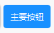

## Button按钮
`MPushButton` 继承了 `QPushButton` 组件，提供了多种按钮样式和尺寸选择。

- **默认按钮** 
  - `MPushButton("默认按钮")`
  
- **按钮样式**
  - `MPushButton("主要按钮").primary()`
  - `MPushButton("成功按钮").success()`
  - `MPushButton("警告按钮").warning()`
  - `MPushButton("危险按钮").danger()`
  
- **按钮大小**
  - `MPushButton("巨型按钮").huge()`
  - `MPushButton("大型按钮").large()`
  - `MPushButton("中型按钮").medium()`
  - `MPushButton("小型按钮").small()`
  - `MPushButton("微型按钮").tiny()`

  

- **按钮图标**
  - `MPushButton("上传按钮", MIcon("cloud_line.svg"))`
  - `MPushButton("文件按钮", MIcon("folder_line.svg", "#1818dd"))`
  
- **禁用按钮**
  ```python
  disabled_button = MPushButton("禁用按钮")
  disabled_button.setEnabled(False)
  ```
  

- **自定义按钮颜色**
  - `MPushButton("自定义颜色按钮").custom_color("#000000")`
  
- **自定义按钮图标**
  
  - `MPushButton("自定义图标按钮", MIcon("图标.png", "#ddd"))`
   将图标放在 `dayu_widgets/static` 目录下，使用 `MIcon` 函数引入即可。

- **组合使用**
  - `MPushButton("删除按钮", MIcon("trash_line.svg", "#ddd")).danger().medium()`
## 示例代码

```python
import asyncio
from PySide2.QtWidgets import QWidget, QApplication, QVBoxLayout, QHBoxLayout
from dayu_widgets.qt import MIcon
from qasync import QEventLoop
from dayu_widgets import MTheme, MPushButton, MPushButtonGroup
class DemoWidget(QWidget):
    def __init__(self, parent=None):
        super(DemoWidget, self).__init__(parent)
        self.setWindowTitle("MPushButton控件学习")
        # 布局
        self.main_layout = QVBoxLayout()
        self.setLayout(self.main_layout)

        # 添加按钮
        self.sub_layout_1 = QHBoxLayout()
        self.main_layout.addLayout(self.sub_layout_1)
        self.sub_layout_1.addWidget(MPushButton("默认按钮"))
        self.sub_layout_1.addWidget(MPushButton("主要按钮").primary())
        self.sub_layout_1.addWidget(MPushButton("成功按钮").success())
        self.sub_layout_1.addWidget(MPushButton("警告按钮").warning())
        self.sub_layout_1.addWidget(MPushButton("危险按钮").danger())
        self.sub_layout_1.addStretch()

        # 添加带图标按钮 MIcon(图标路径，图标颜色)
        self.sub_layout_2 = QHBoxLayout()
        self.main_layout.addLayout(self.sub_layout_2)
        self.sub_layout_2.addWidget(MPushButton("上传按钮", MIcon("cloud_line.svg")))
        self.sub_layout_2.addWidget(MPushButton("文件按钮", MIcon("folder_line.svg", "#1818dd")))
        self.sub_layout_2.addWidget(MPushButton("提交按钮", MIcon("success_line.svg", "#ee00ee")).success())
        self.sub_layout_2.addWidget(MPushButton("编辑按钮", MIcon("edit_line.svg", "#fff")).warning())
        self.sub_layout_2.addWidget(MPushButton("删除按钮", MIcon("trash_line.svg", "#ddd")).danger().medium())
        self.sub_layout_2.addStretch()

        # 按钮大小
        self.sub_layout_3 = QHBoxLayout()
        self.main_layout.addLayout(self.sub_layout_3)
        self.sub_layout_3.addWidget(MPushButton("巨型按钮").huge())
        self.sub_layout_3.addWidget(MPushButton("大型按钮").large())
        self.sub_layout_3.addWidget(MPushButton("中型按钮").medium())
        self.sub_layout_3.addWidget(MPushButton("小型按钮").small())
        self.sub_layout_3.addWidget(MPushButton("微型按钮").tiny())
        self.sub_layout_3.addStretch()

        # 禁用按钮
        self.sub_layout_4 = QHBoxLayout()
        self.main_layout.addLayout(self.sub_layout_4)
        disabled_button = MPushButton("禁用按钮")
        disabled_button.setEnabled(False)
        self.sub_layout_4.addWidget(disabled_button)
        self.sub_layout_4.addStretch()

        # 自定义图标、自定义颜色
        self.sub_layout_5 = QHBoxLayout()
        self.main_layout.addLayout(self.sub_layout_5)
        self.sub_layout_5.addWidget(MPushButton("自定义颜色按钮").custom_color("#000000"))
        # 将自定义的图标文件放置在dayu_widgets/static资源文件夹中，然后引用即可。
        self.sub_layout_5.addWidget(MPushButton("自定义图标按钮", MIcon("图标.png", "#ddd")))
        self.sub_layout_5.addStretch()

        # 按钮组
        self.sub_layout_6 = QHBoxLayout()
        self.main_layout.addLayout(self.sub_layout_6)
        button_group_h = MPushButtonGroup()
        button_group_h.set_button_list([
            {"text": "按钮1", "icon": MIcon("cloud_line.svg", "#EE00EE"), 'type': MPushButton.DangerType, 'clicked': lambda: print("clicked")},
            {"text": "按钮1", "icon": MIcon("cloud_line.svg", "#fff"), 'type': MPushButton.DangerType, 'clicked': lambda: print("clicked")},
            {"text": "按钮1", "icon": MIcon("cloud_line.svg", "#ddd"), 'type': MPushButton.DangerType, 'clicked': lambda: print("clicked")},
        ])
        self.sub_layout_6.addWidget(button_group_h)
        self.sub_layout_6.addStretch()
        self.main_layout.addStretch()
if __name__ == '__main__':
    # 创建主循环
    app = QApplication([])

    # 创建异步事件循环
    loop = QEventLoop(app)
    asyncio.set_event_loop(loop)

    # 创建窗口
    demo_widget = DemoWidget()
    MTheme().apply(demo_widget)
    # 显示窗口
    demo_widget.show()

    loop.run_forever()

