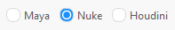
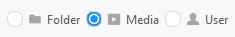
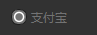

## 简介
`MRadioButton` 继承自`QRadioButton`,用于显示单选按钮。
******
## 初始化
  - `MRadioButton("Maya")`
  - `MRadioButton("Nuke")`
  - `MRadioButton("Houdini")`

    
********
## 带图标
  - ```python
    radio_button_1 = MRadioButton("Folder")
    radio_button_1.setIcon(MIcon("folder_fill.svg"))
    radio_button_2 = MRadioButton("Media")
    radio_button_2.setIcon(MIcon("media_fill.svg"))
    radio_button_2.setChecked(True) # 设置默认选中
    radio_button_3 = MRadioButton("User")
    radio_buttonn_3.setIcon(MIcon("user_fill.svg"))
    ```
    
******
## 设置默认选中
  - `radio_button.setChecked(True)`
********
## 设置禁用
  - `radio_button.setEnabled(False)`
    
********
## 示例代码

```python
import asyncio
from PySide2.QtWidgets import QWidget, QApplication, QVBoxLayout, QHBoxLayout
from dayu_widgets.qt import MIcon
from qasync import QEventLoop
from dayu_widgets import MTheme, MPushButton, MLineEdit, MRadioButton
class DemoWidget(QWidget):
    def __init__(self, parent=None):
        super(DemoWidget, self).__init__(parent)
        self.setWindowTitle("MLoading控件学习")
        # 布局
        self.main_layout = QVBoxLayout()
        self.setLayout(self.main_layout)
        lay_1 = QHBoxLayout()
        lay_1.addWidget(MRadioButton("Maya"))
        lay_1.addWidget(MRadioButton("Nuke"))
        lay_1.addWidget(MRadioButton("Houdini"))
        self.main_layout.addLayout(lay_1)
        check_box_icon_1 = MRadioButton("Folder")
        check_box_icon_1.setIcon(MIcon("folder_fill.svg"))
        check_box_icon_2 = MRadioButton("Media")
        check_box_icon_2.setIcon(MIcon("media_fill.svg"))
        check_box_icon_2.setChecked(True)
        check_box_icon_3 = MRadioButton("User")
        check_box_icon_3.setIcon(MIcon("user_fill.svg"))
        check_box_icon_3.setEnabled(False)
        lay_2 = QHBoxLayout()
        lay_2.addWidget(check_box_icon_1)
        lay_2.addWidget(check_box_icon_2)
        lay_2.addWidget(check_box_icon_3)
        self.main_layout.addLayout(lay_2)
if __name__ == '__main__':
    # 创建主循环
    app = QApplication([])
    # 创建异步事件循环
    loop = QEventLoop(app)
    asyncio.set_event_loop(loop)
    # 创建窗口
    demo_widget = DemoWidget()
    MTheme().apply(demo_widget)
    # 显示窗口
    demo_widget.show()
    loop.run_forever()
