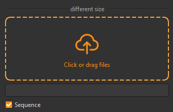

## 简介
MSequenceFile 是一个基于 QtWidgets.QWidget 的组件，用于显示和管理文件路径及其序列信息。该组件特别适用于需要处理文件序列的场景，如视频帧序列、图像序列等。


******
## 初始化
  - `equence_file = MSequenceFile(size=dayu_theme.medium)`
********
## 设置路径
  - `sequence_file.set_path("/path/to/your/file")`
******
## 设置是否为序列
  - `sequence_file.set_sequence(True)`
******
## 信息更新
当路径或序列状态发生变化时，组件会自动更新显示的信息。包括文件名、格式、总数、范围和缺失帧等。
  - `sequence_file.sig_is_sequence_changed.connect(lambda is_sequence: print(f"Sequence state changed to: {is_sequence}"))`
******
## 示例代码

```python
from Qt import QtCore
from Qt import QtWidgets
from dayu_widgets.browser import MDragFileButton
from dayu_widgets.divider import MDivider
from dayu_widgets.sequence_file import MSequenceFile
class SequenceFileExample(QtWidgets.QWidget):
    def __init__(self, parent=None):
        super(SequenceFileExample, self).__init__(parent)
        self._init_ui()
    def _init_ui(self):
        browser = MDragFileButton(text="Click or drag files")
        browser.set_dayu_filters([".py", "pyc", ".jpg", ".mov", "exr"])
        browser.sig_file_changed.connect(self.slot_add_file)
        self.sequence_file_1 = MSequenceFile()
        self.sequence_file_1.set_sequence(True)

        main_lay = QtWidgets.QVBoxLayout()
        main_lay.addWidget(MDivider("different size"))
        main_lay.addWidget(browser)
        main_lay.addWidget(self.sequence_file_1)
        main_lay.addStretch()
        self.setLayout(main_lay)
    @QtCore.Slot(str)
    def slot_add_file(self, f):
        self.sequence_file_1.set_path(f)
if __name__ == "__main__":
    # Import local modules
    from dayu_widgets import dayu_theme
    from dayu_widgets.qt import application
    with application() as app:
        test = SequenceFileExample()
        dayu_theme.apply(test)
        test.show()
```