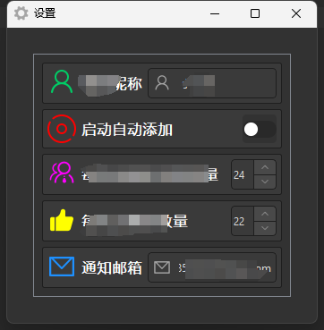

## 简介
`MSettingsWidget` 用于项目中设置参数配置。


******
## 初始化
  - `demo_widget = MSettingsWidget()`
********
## 添加配置项
  - ```python
    demo_widget.add_setting(widget=MSwitch(), field_name=f"is_auto_run", widget_property="checked",
                            widget_signal="toggled",
                            title="自动添加", avatar=MPixmap("icons/自动运行.svg", color="#FF0000"))
    ```
    - `widget`：控件对象，可以是任何控件，但建议使用dayu_widgets控件，因为dayu_widgets控件都支持`field_name`参数
    - `field_name`：字段名，用于绑定数据，如果为None，则不绑定数据
    - `widget_property`：控件的属性，如`checked`、`text`等
    - `widget_signal`：控件的信号，如`toggled`、`textChanged`等
    - `title`：标题，用于显示在左侧
    - `avatar`：图标，用于显示在左侧，可以是`MPixmap`对象或字符串
******
## 示例代码

```python
import asyncio
from PySide2.QtWidgets import QWidget, QApplication, QVBoxLayout
from dayu_widgets.qt import MIcon, MPixmap
from qasync import QEventLoop
from dayu_widgets import MTheme,MLineEdit, \
    MFieldMixin, MToolButton, MSwitch, MSpinBox
from tinydb import TinyDB
from settings_widget import MSettingsWidget
NICKNAME = 'nickname'  # 微信昵称
IS_AUTO_RUN = 'is_auto_run'  # 是否自动运行
EVERY_ADD_NUMBER = 'every_add_number'  # 每次添加好友的数量
THUMBS_UP_NUMBER = 'thumbs_up_number'  # 点赞数量
NOTIFY_EMAIL = 'notify_email'  # 通知邮箱
class SettingInterface(QWidget, MFieldMixin):
    def __init__(self, parent=None):
        super(SettingInterface, self).__init__(parent)
        # 初始化加载数据库
        self.json_db = TinyDB(path='json_db.json', ensure_ascii=False, encoding='utf-8')
        self.table_WeChatGroupList = self.json_db.table('WeChatGroupList')
        self.table_Settings = self.json_db.table('Settings')
        # 初始化UI
        self.init_ui()
    def init_ui(self):
        self.setWindowTitle('设置')
        self.setWindowIcon(MIcon(path="icons/配置.svg"))
        # 布局
        self.main_layout = QVBoxLayout()
        self.setLayout(self.main_layout)
        # 创建窗口
        settings_widget = MSettingsWidget()
        line_edit_name = MLineEdit()
        line_edit_name.set_prefix_widget(MToolButton().svg("icons/微信昵称.svg").icon_only())
        line_edit_name.set_delay_duration(millisecond=2000)  # 延迟时间（毫秒）
        settings_widget.add_setting(widget=line_edit_name, field_name=NICKNAME,
                                    widget_property="text",
                                    widget_signal="textChanged",
                                    title="微信昵称", avatar=MPixmap("icons/微信昵称.svg", color="#00CD66"))
        settings_widget.add_setting(widget=MSwitch(), field_name=IS_AUTO_RUN, widget_property="checked",
                                    widget_signal="toggled",
                                    title="启动自动添加", avatar=MPixmap("icons/自动运行.svg", color="#FF0000"))
        m_spin_box_every_add_number = MSpinBox()
        m_spin_box_every_add_number.setRange(1, 100)
        m_spin_box_every_add_number.setValue(20)
        settings_widget.add_setting(widget=m_spin_box_every_add_number, field_name=EVERY_ADD_NUMBER,
                                    widget_property="value",
                                    widget_signal="valueChanged",
                                    title="好友数量", avatar=MPixmap("icons/好友数量.svg", color="#FF00FF"))
        m_spin_box_thumbs_up_number = MSpinBox()
        m_spin_box_thumbs_up_number.setRange(1, 100)
        m_spin_box_thumbs_up_number.setValue(20)
        settings_widget.add_setting(widget=m_spin_box_thumbs_up_number, field_name=THUMBS_UP_NUMBER,
                                    widget_property="value",
                                    widget_signal="valueChanged",
                                    title="点赞数量", avatar=MPixmap("icons/点赞数量.svg", color="#FFFF00"))
        line_edit_email = MLineEdit()
        line_edit_email.set_prefix_widget(MToolButton().svg("icons/邮箱.svg").icon_only())
        line_edit_email.set_delay_duration(millisecond=2000)  # 延迟时间（毫秒）
        settings_widget.add_setting(widget=line_edit_email, field_name=NOTIFY_EMAIL,
                                    widget_property="text",
                                    widget_signal="textChanged",
                                    title="通知邮箱", avatar=MPixmap("icons/邮箱.svg", color="#1E90FF"))
        self.main_layout.addWidget(settings_widget)
if __name__ == '__main__':
    # 创建主循环
    app = QApplication([])
    # 创建异步事件循环
    loop = QEventLoop(app)
    asyncio.set_event_loop(loop)
    # 创建窗口
    demo_widget = SettingInterface()
    MTheme(theme='dark').apply(demo_widget)
    # 显示窗口
    demo_widget.show()
    loop.run_forever()
```
