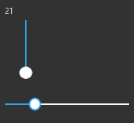

## 简介
`CSlider` 是一个基于 `PySide2` 的自定义滑块控件，用于在应用程序中实现滑动选择功能。它支持横向和竖向两种方向，并且具有自定义的样式和鼠标点击事件处理


******
## 代码
```python
import asyncio
from PySide2.QtCore import Qt
from PySide2.QtWidgets import QSlider, QStyleOptionSlider, QStyle, QWidget, QVBoxLayout, QLabel, QApplication
from dayu_widgets import MTheme
from qasync import QEventLoop
# 普通样式
Style = """
/*横向*/
QSlider:horizontal {
    min-height: 60px;
}
QSlider::groove:horizontal {
    height: 2px;
    background: white;
}
QSlider::handle:horizontal {
    width: 30px;
    margin: 0 -6px;
    margin-top: -15px;
    margin-bottom: -15px;
    border-radius: 15px;
    background: qradialgradient(spread:reflect, cx:0.5, cy:0.5, radius:0.5, fx:0.5, fy:0.5, stop:0.5 rgba(255, 255, 255, 255), stop:0.6 rgba(255, 255, 255, 100), stop:0.61 rgba(255, 255, 255, 0));
}
QSlider::handle:horizontal:hover {
    background: qradialgradient(spread:reflect, cx:0.5, cy:0.5, radius:0.5, fx:0.5, fy:0.5, stop:0.40113 rgba(255, 255, 255, 255), stop:0.502825 rgba(44, 167, 248, 255), stop:0.59887 rgba(44, 167, 248, 100), stop:0.61 rgba(44, 167, 248, 0));
}
QSlider::add-page:horizontal {
    background: white;
}
QSlider::sub-page:horizontal {
    background: rgb(44, 167, 248);
}
/*竖向*/
QSlider:vertical {
    min-width: 60px;
}
QSlider::groove:vertical {
    width: 2px;
    background: white; 
}
QSlider::handle:vertical {
    height: 30px;
    margin: -6px 0;
    margin-left: -15px;
    margin-right: -15px;
    border-radius: 15px;
    background: qradialgradient(spread:reflect, cx:0.5, cy:0.5, radius:0.5, fx:0.5, fy:0.5, stop:0.5 rgba(255, 255, 255, 255), stop:0.6 rgba(255, 255, 255, 100), stop:0.61 rgba(255, 255, 255, 0));
}
QSlider::handle:vertical:hover {
    background: qradialgradient(spread:reflect, cx:0.5, cy:0.5, radius:0.5, fx:0.5, fy:0.5, stop:0.40113 rgba(255, 255, 255, 255), stop:0.502825 rgba(44, 167, 248, 255), stop:0.59887 rgba(44, 167, 248, 100), stop:0.61 rgba(44, 167, 248, 0));
}
QSlider::add-page:vertical {
    background: white;
}
QSlider::sub-page:vertical {
    background: rgb(44, 167, 248);
}
"""
class CSlider(QSlider):
    def __init__(self, *args, **kwargs):
        super(CSlider, self).__init__(*args, **kwargs)
        self.setCursor(Qt.PointingHandCursor)
        self.setStyleSheet(Style)
    def mousePressEvent(self, event):
        # 获取上面的拉动块位置
        option = QStyleOptionSlider()
        self.initStyleOption(option)
        rect = self.style().subControlRect(
            QStyle.CC_Slider, option, QStyle.SC_SliderHandle, self)
        if rect.contains(event.pos()):
            # 如果鼠标点击的位置在滑块上则交给Qt自行处理
            super(CSlider, self).mousePressEvent(event)
            return
        if self.orientation() == Qt.Horizontal:
            # 横向，要考虑invertedAppearance是否反向显示的问题
            self.setValue(self.style().sliderValueFromPosition(
                self.minimum(), self.maximum(),
                event.x() if not self.invertedAppearance() else (self.width(
                ) - event.x()), self.width()))
        else:
            # 纵向
            self.setValue(self.style().sliderValueFromPosition(
                self.minimum(), self.maximum(),
                (self.height() - event.y()) if not self.invertedAppearance(
                ) else event.y(), self.height()))
class DemoWindow(QWidget):
    def __init__(self, *args, **kwargs):
        super(DemoWindow, self).__init__(*args, **kwargs)
        layout = QVBoxLayout(self)
        self.labelValue = QLabel(self)
        layout.addWidget(self.labelValue)
        v_slider = CSlider(orientation=Qt.Vertical, parent=self)
        v_slider.valueChanged.connect(lambda v: self.labelValue.setText(str(v)))
        layout.addWidget(v_slider)
        h_slider = CSlider(orientation=Qt.Horizontal, parent=self)
        h_slider.valueChanged.connect(lambda v: self.labelValue.setText(str(v)))
        layout.addWidget(h_slider)
if __name__ == '__main__':
    # 创建主循环
    app = QApplication([])
    # 创建异步事件循环
    loop = QEventLoop(app)
    asyncio.set_event_loop(loop)
    widget = DemoWindow()
    MTheme(theme='dark').apply(widget)
    # 显示窗口
    widget.show()
    # 显示窗口
    with loop:
        loop.run_forever()
```
********
## 主要功能
 - 支持横向和竖向两种方向。
 - 自定义样式，包括滑块和轨道的样式。
 - 鼠标点击事件处理，允许用户直接点击滑块以外的区域来快速调整滑块位置。
******
## 设置值
  - `slider.setValue(-80)`
******
