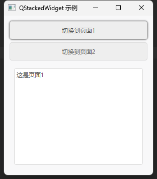

## 简介
`MStackedWidget` 是一个容器控件，可用来控制多页面的切换，并且一次只显示其中一个子控件。它通常用于创建多页面的用户界面，每个页面可以是一个独立的 QWidget。通过添加动画效果来增强用户界面的交互体验。当当前页面切换时，会触发平滑的过渡动画。


******
## 初始化
  - `stacked_widget = MStackedWidget()`
********
## 添加页面
  - `index= stacked_widget.addWidget(page1)` # 子控件的索引
  - `index= stacked_widget.addWidget(page2)`
********
## 页面切换
  - `stacked_widget.setCurrentIndex(0)`
********
## 禁用动画
  - `stacked_widget.disable_animation()`
********
## 容器内子控件数量
  - `count = self.stacked_widget.count()`
********
## 获取当前显示的子控件
  - `widget = self.stacked_widget.currentWidget()`
********
## 获取指定索引的子控件
  - `self.stacked_widget.widget(1)`
********
## 获取当前显示的子控件的索引
  - `index = self.stacked_widget.currentIndex()`
********
## 在指定位置插入一个子控件
  - `index = self.stacked_widget.insertWidget(1, DemoPage("3"))`
********
## 示例代码

```python
import asyncio
from PySide2.QtWidgets import QApplication, QWidget, QVBoxLayout
from dayu_widgets import MPushButton, MTheme, MTextEdit
from dayu_widgets.stacked_widget import MStackedWidget
from qasync import QEventLoop
class DemoPage(QWidget):
    def __init__(self, page_name):
        super().__init__()
        layout = QVBoxLayout()
        layout.addWidget(MTextEdit(f"这是页面{page_name}"))
        self.setLayout(layout)
class StackedExample(QWidget):
    def __init__(self):
        super(StackedExample, self).__init__()
        self.setWindowTitle("QStackedWidget 示例")
        # 创建 QStackedWidget
        self.stacked_widget = MStackedWidget()
        page1 = DemoPage("1")
        page2 = DemoPage("2")
        self.stacked_widget.addWidget(page1)
        self.stacked_widget.addWidget(page2)
        # 创建按钮用于切换页面
        self.btn_page1 = MPushButton("切换到页面1")
        self.btn_page2 = MPushButton("切换到页面2")
        # 连接按钮的点击事件到切换页面的槽函数
        self.btn_page1.clicked.connect(lambda: self.stacked_widget.setCurrentIndex(0))
        self.btn_page2.clicked.connect(lambda: self.stacked_widget.setCurrentIndex(1))
        # 主布局
        main_layout = QVBoxLayout()
        main_layout.addWidget(self.btn_page1)
        main_layout.addWidget(self.btn_page2)
        main_layout.addWidget(self.stacked_widget)
        self.setLayout(main_layout)
if __name__ == '__main__':
    # 创建主循环
    app = QApplication([])
    # 创建异步事件循环
    loop = QEventLoop(app)
    asyncio.set_event_loop(loop)
    # 创建窗口
    widget = StackedExample()
    MTheme().apply(widget)
    # 设置属性
    # 显示窗口
    widget.show()
    loop.run_forever()
```