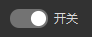

## 简介
`MSwitch` 类继承自 `QRadioButton`，用于创建一个开关选择器。它支持不同的大小，并且可以调整其外观。
******
## 初始化
  - `switch = MSwitch()`
********
## 设置状态
  - `switch.setChecked(True)`
********
## 设置文本
  - `switch.setText("开关")`
********
## 大小
  - `switch.huge()  # 设置为巨大尺寸`
  - `switch.large()  # 设置为大尺寸`
  - `switch.medium()  # 设置为中尺寸`
  - `switch.small()  # 设置为小尺寸`
  - `switch.tiny()  # 设置为微小尺寸`
******
## 禁用
  - `switch.setEnabled(False)`
********
## 示例代码

```python
from Qt import QtWidgets
from dayu_widgets import dayu_theme
from dayu_widgets.divider import MDivider
from dayu_widgets.field_mixin import MFieldMixin
from dayu_widgets.switch import MSwitch
class SwitchExample(QtWidgets.QWidget, MFieldMixin):
    def __init__(self, parent=None):
        super(SwitchExample, self).__init__(parent)
        self.setWindowTitle("Examples for MSwitch")
        self._init_ui()
    def _init_ui(self):
        switch = MSwitch()
        switch.setChecked(True)
        switch.setText("开关")
        check_box_2 = MSwitch()
        check_box_3 = MSwitch()
        switch.setEnabled(True)
        lay = QtWidgets.QHBoxLayout()
        lay.addWidget(switch)
        lay.addWidget(check_box_2)
        lay.addWidget(check_box_3)
        size_lay = QtWidgets.QFormLayout()
        size_lay.addRow("Huge", MSwitch().huge())
        size_lay.addRow("Large", MSwitch().large())
        size_lay.addRow("Medium", MSwitch().medium())
        size_lay.addRow("Small", MSwitch().small())
        size_lay.addRow("Tiny", MSwitch().tiny())
        main_lay = QtWidgets.QVBoxLayout()
        main_lay.addWidget(MDivider("Basic"))
        main_lay.addLayout(lay)
        main_lay.addWidget(MDivider("different size"))
        main_lay.addLayout(size_lay)
        main_lay.addStretch()
        self.setLayout(main_lay)
if __name__ == "__main__":
    from dayu_widgets.qt import application
    with application() as app:
        test = SwitchExample()
        dayu_theme.apply(test)
        test.show()
