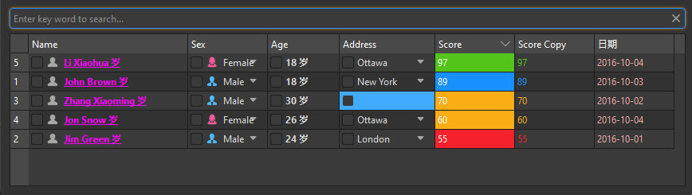

## 简介
`MTableView` 是一个基于 `QtWidgets.QTableView` 的自定义表格视图类，用于展示数据，并提供了丰富的功能如上下文菜单、无数据时的自定义显示、列头状态保存与加载等。


******
## 初始化
  - `table_view = MTableView(size=dayu_theme.small, show_row_count=True)`
    - `size`表格大小，可选值为 `dayu_theme.small`, `dayu_theme.medium`, `dayu_theme.large`。
    - `show_row_count`是否显示行号
********
## 是否显示网格线
  - `table_view.setShowGrid(True)`
## 设置头
  ```python
  setting = {
        'key': attr,  # 必填，用来读取 model后台数据结构的属性
        'label': attr.title(),  # 选填，显示在界面的该列的名字
        'width': 100,  # 选填，单元格默认的宽度
        'default_filter': False,  # 选填，如果有组合的filter组件，该属性默认是否显示，默认False
        'searchable': False,  # 选填，如果有搜索组件，该属性是否可以被搜索，默认False
        'editable': False,  # 选填，该列是否可以双击编辑，默认False
        'selectable': False,  # 选填，该列是否可以双击编辑，且使用下拉列表选择。该下拉框的选项们，是通过 data 拿数据的
        'checkable': False,  # 选填，该单元格是否要加checkbox，默认False
        'exclusive': True,  # 配合selectable，如果是可以多选的则为 False，如果是单选，则为True
        'order': None,  # 选填，初始化时，该列的排序方式, 0 升序，1 降序
        # 下面的是每个单元格的设置，主要用来根据本单元格数据，动态设置样式
        'color': None,  # QColor选填，该单元格文字的颜色，例如根据百分比数据大小，大于100%显示红色，小于100%显示绿色
        'bg_color': None,  # 选填，该单元格的背景色，例如根据bool数据，True显示绿色，False显示红色
        'display': None,  # 选填，该单元显示的内容，例如数据是以分钟为单位，可以在这里给转换成按小时为单位
        'align': None,  # 选填，该单元格文字的对齐方式
        'font': None,  # 选填，该单元格文字的格式，例如加下划线、加粗等等
        'icon': None,  # 选填，该单格元的图标，注意，当 QListView 使用图标模式时，每个item的图片也是在这里设置
        'tooltip': None,  # 选填，鼠标指向该单元格时，显示的提示信息
        'size': None,  # 选填，该列的 hint size，设置
        'data': None,
        'edit': None
    }
  ```
*******

## 模拟数据
  - ```python
    def score_color(score, y):
        if score < 60:
            return dayu_theme.error_color
        elif score < 80:
            return dayu_theme.warning_color
        elif score >= 90:
            return dayu_theme.success_color
        return dayu_theme.info_color

    header_list = [
            {
                "label": "Name",
                "key": "name",
                "checkable": True,  # 是否支持勾选
                "searchable": True,  # 是否支持搜索
                "draggable": True,  # 是否支持拖拽
                "droppable": True,  # 是否支持拖放
                "editable": True,  # 是否支持编辑(如果是下拉框，则无法双击编辑，只能下拉选择)
                "selectable": False,  # 是否支持下拉框选择
                "exclusive": True,  # 下拉框选择是否单选
                "width": 200,
                "font": lambda x, y: {"underline": True, "bold": True},  # 字体样式
                "icon": "user_fill.svg",  # 图标，可以动态图标
                "display": lambda x, y: f"{x} 岁",  # 显示格式化
                "order": "desc",  # 排序
                "bg_color": lambda x, y: "transparent" if x else dayu_theme.error_color,  # 背景颜色
                "color": "#ff00ff",  # 文本颜色
            },
            {
                "label": "Sex",
                "key": "sex",
                "checkable": True,  # 是否支持勾选
                "searchable": True,  # 是否支持搜索
                "editable": True,  # 是否支持编辑
                "draggable": True,  # 是否支持拖拽
                "droppable": True,  # 是否支持拖放
                "selectable": True,
                "icon": lambda x, y: (f"{x.lower()}.svg", getattr(dayu_theme, x.lower() + "_color")),
            },
            {
                "label": "Age",
                "key": "age",
                "width": 90,
                "checkable": True,  # 是否支持勾选
                "searchable": True,  # 是否支持搜索
                "editable": True,  # 是否支持编辑
                "draggable": True,  # 是否支持拖拽
                "droppable": True,  # 是否支持拖放
                "display": lambda x, y: "{} 岁".format(x),
                "font": lambda x, y: {"bold": True},
            },
            {
                "label": "Address",
                "key": "city",
                "checkable": True,  # 是否支持勾选
                "searchable": True,  # 是否支持搜索
                "editable": True,  # 是否支持编辑
                "draggable": True,  # 是否支持拖拽
                "droppable": True,  # 是否支持拖放
                "selectable": True,
                "exclusive": True,
                "width": 120,
                "display": lambda x, y: " & ".join(x) if isinstance(x, list) else x,
                "bg_color": lambda x, y: "transparent" if x else dayu_theme.error_color,
            },
            {
                "label": "Score",
                "key": "score",
                "searchable": True,
                "editable": True,
                "order": "desc",
                "bg_color": score_color,
                "color": "#fff",
            },
            {
                "label": "Score Copy",
                "key": "score",
                "searchable": True,
                "color": score_color
            },
            {
                "label": "日期",
                "key": "date",
                "searchable": True,
                "color": '#eaa'
            },
        ]

    data_list = [
            {
                "name": "John Brown",
                "sex": "Male",
                "sex_list": ["Male", "Female"],
                "age": 18,
                "score": 89,
                "city": "New York",
                "city_list": ["New York", "Ottawa", "London", "Sydney"],
                "date": "2016-10-03",
            },
            {
                "name": "Jim Green",
                "sex": "Male",
                "sex_list": ["Male", "Female"],
                "age": 24,
                "score": 55,
                "city": "London",
                "city_list": ["New York", "Ottawa", "London", "Sydney"],
                "date": "2016-10-01",
            },
            {
                "name": "Zhang Xiaoming",
                "sex": "Male",
                "sex_list": ["Male", "Female"],
                "age": 30,
                "score": 70,
                "city": "",
                "city_list": ["Beijing", "Shanghai", "Shenzhen", "Guangzhou"],
                "date": "2016-10-02",
            },
            {
                "name": "Jon Snow",
                "sex": "Female",
                "sex_list": ["Male", "Female"],
                "age": 26,
                "score": 60,
                "city": "Ottawa",
                "city_list": ["New York", "Ottawa", "London", "Sydney"],
                "date": "2016-10-04",
            },
            {
                "name": "Li Xiaohua",
                "sex": "Female",
                "sex_list": ["Male", "Female"],
                "age": 18,
                "score": 97,
                "city": "Ottawa",
                "city_list": ["New York", "Ottawa", "London", "Sydney"],
                "date": "2016-10-04",
            },
        ]
    ```
******
## 构建数据模型
  - ```python
    data_list = [...]
    model = MTableModel()
    model.set_header_list(header_list)
    model.set_data_list(data_list)
    ```
******
## 构建排序模型
  - ```python
    # 构建排序模型
    self.model_sort = MSortFilterModel()
    self.model_sort.setSourceModel(model)
    self.model_sort.set_header_list(header_list)
    ```
******
## 构建表格
  - ```python
    # 构建表格
    table_view = MTableView(size=dayu_theme.small, show_row_count=True)
    table_view.setModel(self.model_sort)
    table_view.set_header_list(header_list)
    table_view.setShowGrid(True)
    ```
******
## 搜索功能
  - ```python
    # 搜索栏
    line_edit = MLineEdit().search().small()
    line_edit.textChanged.connect(self.model_sort.set_search_pattern)
    ```
******
## 示例代码

```python
import asyncio
from PySide2.QtWidgets import QWidget, QApplication, QVBoxLayout
from qasync import QEventLoop
from dayu_widgets import MTheme, MFieldMixin, dayu_theme, MTableModel, MSortFilterModel, MLineEdit, \
    MTableView
class DemoWidget(QWidget, MFieldMixin):
    def __init__(self, parent=None):
        super(DemoWidget, self).__init__(parent)
        layout = QVBoxLayout()
        self.setLayout(layout)
        def score_color(score, y):
            if score < 60:
                return dayu_theme.error_color
            elif score < 80:
                return dayu_theme.warning_color
            elif score >= 90:
                return dayu_theme.success_color
            return dayu_theme.info_color
        header_list = [
            {
                "label": "Name",
                "key": "name",
                "checkable": True,  # 是否支持勾选
                "searchable": True,  # 是否支持搜索
                "draggable": True,  # 是否支持拖拽
                "droppable": True,  # 是否支持拖放
                "editable": True,  # 是否支持编辑(如果是下拉框，则无法双击编辑，只能下拉选择)
                "selectable": False,  # 是否支持下拉框选择
                "exclusive": True,  # 下拉框选择是否单选
                "width": 200,
                "font": lambda x, y: {"underline": True, "bold": True},  # 字体样式
                "icon": "user_fill.svg",  # 图标，可以动态图标
                "display": lambda x, y: f"{x} 岁",  # 显示格式化
                "order": "desc",  # 排序
                "bg_color": lambda x, y: "transparent" if x else dayu_theme.error_color,  # 背景颜色
                "color": "#ff00ff",  # 文本颜色
            },
            {
                "label": "Sex",
                "key": "sex",
                "checkable": True,  # 是否支持勾选
                "searchable": True,  # 是否支持搜索
                "editable": True,  # 是否支持编辑
                "draggable": True,  # 是否支持拖拽
                "droppable": True,  # 是否支持拖放
                "selectable": True,
                "icon": lambda x, y: (f"{x.lower()}.svg", getattr(dayu_theme, x.lower() + "_color")),
            },
            {
                "label": "Age",
                "key": "age",
                "width": 90,
                "checkable": True,  # 是否支持勾选
                "searchable": True,  # 是否支持搜索
                "editable": True,  # 是否支持编辑
                "draggable": True,  # 是否支持拖拽
                "droppable": True,  # 是否支持拖放
                "display": lambda x, y: "{} 岁".format(x),
                "font": lambda x, y: {"bold": True},
            },
            {
                "label": "Address",
                "key": "city",
                "checkable": True,  # 是否支持勾选
                "searchable": True,  # 是否支持搜索
                "editable": True,  # 是否支持编辑
                "draggable": True,  # 是否支持拖拽
                "droppable": True,  # 是否支持拖放
                "selectable": True,
                "exclusive": True,
                "width": 120,
                "display": lambda x, y: " & ".join(x) if isinstance(x, list) else x,
                "bg_color": lambda x, y: "transparent" if x else dayu_theme.error_color,
            },
            {
                "label": "Score",
                "key": "score",
                "searchable": True,
                "editable": True,
                "order": "desc",
                "bg_color": score_color,
                "color": "#fff",
            },
            {
                "label": "Score Copy",
                "key": "score",
                "searchable": True,
                "color": score_color
            },
            {
                "label": "日期",
                "key": "date",
                "searchable": True,
                "color": '#eaa'
            },
        ]
        data_list = [
            {
                "name": "John Brown",
                "sex": "Male",
                "sex_list": ["Male", "Female"],
                "age": 18,
                "score": 89,
                "city": "New York",
                "city_list": ["New York", "Ottawa", "London", "Sydney"],
                "date": "2016-10-03",
            },
            {
                "name": "Jim Green",
                "sex": "Male",
                "sex_list": ["Male", "Female"],
                "age": 24,
                "score": 55,
                "city": "London",
                "city_list": ["New York", "Ottawa", "London", "Sydney"],
                "date": "2016-10-01",
            },
            {
                "name": "Zhang Xiaoming",
                "sex": "Male",
                "sex_list": ["Male", "Female"],
                "age": 30,
                "score": 70,
                "city": "",
                "city_list": ["Beijing", "Shanghai", "Shenzhen", "Guangzhou"],
                "date": "2016-10-02",
            },
            {
                "name": "Jon Snow",
                "sex": "Female",
                "sex_list": ["Male", "Female"],
                "age": 26,
                "score": 60,
                "city": "Ottawa",
                "city_list": ["New York", "Ottawa", "London", "Sydney"],
                "date": "2016-10-04",
            },
            {
                "name": "Li Xiaohua",
                "sex": "Female",
                "sex_list": ["Male", "Female"],
                "age": 18,
                "score": 97,
                "city": "Ottawa",
                "city_list": ["New York", "Ottawa", "London", "Sydney"],
                "date": "2016-10-04",
            },
        ]
        # 构建数据模型
        model = MTableModel()
        model.set_header_list(header_list)
        model.set_data_list(data_list)

        # 构建排序模型
        self.model_sort = MSortFilterModel()
        self.model_sort.setSourceModel(model)
        self.model_sort.set_header_list(header_list)

        # 构建表格
        table_view = MTableView(size=dayu_theme.small, show_row_count=True)
        table_view.setModel(self.model_sort)
        table_view.set_header_list(header_list)
        table_view.setShowGrid(True)

        # 搜索栏
        line_edit = MLineEdit().search().small()
        line_edit.textChanged.connect(self.model_sort.set_search_pattern)

        layout.addWidget(line_edit)
        layout.addWidget(table_view)
        layout.addStretch()
if __name__ == '__main__':
    # 创建主循环
    app = QApplication([])
    # 创建异步事件循环
    loop = QEventLoop(app)
    asyncio.set_event_loop(loop)
    # 创建窗口
    demo_widget = DemoWidget()
    MTheme("dark").apply(demo_widget)
    # 显示窗口
    demo_widget.show()
    loop.run_forever()
```