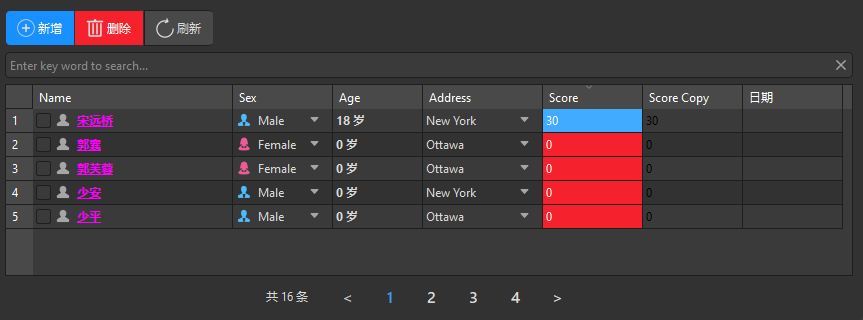

## 简介

一个基于 `QtWidgets.QTableView` 和 `TinyDB` 的增删改查模板。


******

## CRUD模板

  ```python
import asyncio
from math import ceil
from PySide2 import QtCore
from PySide2.QtCore import Slot, QModelIndex
from PySide2.QtWidgets import QWidget, QApplication, QVBoxLayout, QHBoxLayout
from dayu_widgets.qt import MIcon
from qasync import QEventLoop
from dayu_widgets import MTheme, MFieldMixin, dayu_theme, MTableModel, MSortFilterModel, MLineEdit, \
    MTableView, MPushButtonGroup, MPushButton, MMessage
from tinydb import Query,TinyDB
from tinydb.table import Document
# 见分页控件
from custom_widget.CPaginationBar import CPaginationBar, FlatStyle
class VirtualChatInterface(QWidget, MFieldMixin):
    def __init__(self, parent=None):
        super(VirtualChatInterface, self).__init__(parent)
        self.table_demo = TinyDB(path='json_db.json', ensure_ascii=False, encoding='utf-8').table('Demo')
        self.page_number = 1  # 当前页码
        self.page_size = 5  # 每页数量
        self.total_count = 0  # 总数量
        self.total_page = 0  # 总页码
        self.data_list = []  # 数据列表
        self.init_ui()
        self.reload_data()
    def init_ui(self):
        self.layout = QVBoxLayout()
        self.setLayout(self.layout)
        # 构建数据模型
        self.table_model = MTableModel()
        header_list = [
            {
                "label": "Name",
                "key": "name",
                "checkable": True,  # 是否支持勾选
                "searchable": True,  # 是否支持搜索
                "draggable": True,  # 是否支持拖拽
                "droppable": True,  # 是否支持拖放
                "editable": True,  # 是否支持编辑(如果是下拉框，则无法双击编辑，只能下拉选择)
                "selectable": False,  # 是否支持下拉框选择
                "exclusive": True,  # 下拉框选择是否单选
                "width": 200,
                "font": lambda x, y: {"underline": True, "bold": True},  # 字体样式
                "icon": "user_fill.svg",  # 图标，可以动态图标
                "display": lambda x, y: f"{x}",  # 显示格式化
                "order": QtCore.Qt.SortOrder.DescendingOrder,  # 排序
                "bg_color": lambda x, y: "transparent" if x else dayu_theme.error_color,  # 背景颜色
                "color": "#ff00ff",  # 文本颜色
            },
            {
                "label": "Sex",
                "key": "sex",
                "checkable": False,  # 是否支持勾选
                "searchable": True,  # 是否支持搜索
                "editable": True,  # 是否支持编辑
                "draggable": True,  # 是否支持拖拽
                "droppable": True,  # 是否支持拖放
                "selectable": True,
                "icon": lambda x, y: (f"{x.lower()}.svg", getattr(dayu_theme, x.lower() + "_color")),
            },
            {
                "label": "Age",
                "key": "age",
                "width": 90,
                "checkable": False,  # 是否支持勾选
                "searchable": True,  # 是否支持搜索
                "editable": True,  # 是否支持编辑
                "draggable": True,  # 是否支持拖拽
                "droppable": True,  # 是否支持拖放
                "display": lambda x, y: "{} 岁".format(x),
                "font": lambda x, y: {"bold": True},
            },
            {
                "label": "Address",
                "key": "city",
                "checkable": False,  # 是否支持勾选
                "searchable": True,  # 是否支持搜索
                "editable": True,  # 是否支持编辑
                "draggable": True,  # 是否支持拖拽
                "droppable": True,  # 是否支持拖放
                "selectable": True,
                "exclusive": True,
                "width": 120,
                "display": lambda x, y: " & ".join(x) if isinstance(x, list) else x,
                "bg_color": lambda x, y: "transparent" if x else dayu_theme.error_color,
            },
            {
                "label": "Score",
                "key": "score",
                "searchable": True,
                "editable": True,
                "order": QtCore.Qt.SortOrder.DescendingOrder,
                "bg_color": lambda score, y: dayu_theme.success_color if score > 60 else dayu_theme.error_color,
                "color": "#fff",
            },
            {
                "label": "Score Copy",
                "key": "score",
                "searchable": True,
                "color": lambda score, y: "#fff" if score > 60 else "#000",
            },
            {
                "label": "日期",
                "key": "date",
                "searchable": True,
                "color": '#eaa'
            },
        ]
        self.table_model.set_header_list(header_list)
        # 修改数据
        self.table_model.dataChanged.connect(self.data_changed_handle)

        # 构建排序模型
        self.model_sort = MSortFilterModel()
        self.model_sort.setSourceModel(self.table_model)
        self.model_sort.set_header_list(header_list)

        # 构建表格
        table_view = MTableView(size=dayu_theme.small, show_row_count=True)
        table_view.setModel(self.model_sort)
        table_view.set_header_list(header_list)
        table_view.setShowGrid(True)
        table_view.enable_context_menu(True)

        # 搜索栏
        line_edit = MLineEdit().search().small()
        line_edit.textChanged.connect(self.model_sort.set_search_pattern)

        # 按钮组
        button_group = MPushButtonGroup()
        button_group.set_button_list([
            {"text": "新增", "icon": MIcon("icons/新增 (1).svg", "#ddd"), 'dayu_type': MPushButton.PrimaryType,
             'clicked': self.add},
            {"text": "删除", "icon": MIcon("icons/删除.svg", "#ddd"), 'dayu_type': MPushButton.DangerType,
             'clicked': self.delete},
            {"text": "刷新", "icon": MIcon("icons/刷新.svg", "#ddd"), 'dayu_type': MPushButton.DefaultType,
             'clicked': self.reload_data}
        ])
        qh_box_layout = QHBoxLayout()
        qh_box_layout.addWidget(button_group)
        qh_box_layout.addStretch()

        # 分页控件
        self.paginationBar = CPaginationBar(self, totalPages=20)
        self.paginationBar.setInfos(f'共 {self.total_count} 条')
        # 设置扁平样式
        self.paginationBar.setStyleSheet(FlatStyle)
        self.paginationBar.pageChanged.connect(self.page_changed_handle)

        self.layout.addLayout(qh_box_layout)
        self.layout.addWidget(line_edit)
        self.layout.addWidget(table_view)
        self.layout.addWidget(self.paginationBar)
        self.layout.addStretch()
    def reload_data(self):
        """
        加载数据
        :return:
        """
        query = Query()
        self.total_count = len(self.table_demo)  # 数据总数
        self.total_page = ceil(self.total_count / self.page_size)  # 计算总页码
        # 防止超页
        if self.page_number > self.total_page:
            self.page_number = self.total_page
        self.paginationBar.setTotalPages(self.total_page)
        self.paginationBar.setInfos(f'共 {self.total_count} 条')
        self.paginationBar.setCurrentPage(self.page_number)

        # 计算起始索引
        start_index = (self.page_number - 1) * self.page_size
        self.data_list = self.table_demo.all()[start_index:start_index + self.page_size]
        self.table_model.set_data_list(self.data_list)
    @Slot()
    def data_changed_handle(self, param: QModelIndex):
        row = param.row()  # 行号
        column = param.column()  # 列号
        if param.isValid():
            model: MTableModel = param.model()  # 数据模型
            row_data: Document = model.get_data_list()[row]  # 当前行数据，xxx_checked是否选中
            copy = row_data.copy()
            del copy['_parent']  # 去除出循环引用
            self.table_demo.update(copy, doc_ids=[row_data.doc_id])
    def add(self):
        """
        新增数据
        :return:
        """
        self.table_demo.insert({
            "name": "",
            "sex": "",
            "sex_list": ["Male", "Female"],
            "age": 0,
            "score": 0,
            "city": "",
            "city_list": ["New York", "Ottawa", "London", "Sydney"],
            "date": "",
        }, )
        self.total_count += + 1
        self.total_page = ceil(self.total_count / self.page_size)
        self.page_number = self.total_page
        self.paginationBar.setCurrentPage(self.page_number)
        self.reload_data()
    def delete(self):
        """
        删除数据
        :return:
        """
        data_list = self.table_model.get_data_list()
        # 删除选中项
        checked_doc_ids = [data.doc_id for data in data_list if data.get("name_checked", 0) == 2]
        if len(checked_doc_ids) == 0:
            MMessage.error("未选中", parent=self)
        self.table_demo.remove(doc_ids=checked_doc_ids)
        self.reload_data()
    def page_changed_handle(self, page):
        self.page_number = page
        self.reload_data()
if __name__ == '__main__':
    # 创建主循环
    app = QApplication([])
    # 创建异步事件循环
    loop = QEventLoop(app)
    asyncio.set_event_loop(loop)
    # 创建窗口
    demo_widget = VirtualChatInterface()
    MTheme("dark").apply(demo_widget)
    # 显示窗口
    demo_widget.show()
    with loop:
        loop.run_forever()

  ```

*******