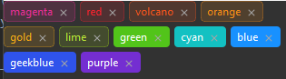

## 简介
`MTag` 是一个基于 `QLabel` 的自定义组件，用于创建标签（tag）控件。它可以用于分类或标记内容，支持点击事件、关闭按钮、颜色设置等功能。此组件适用于多种 UI 场景，如标签云、过滤器等。


******
## 基础
  - ```python
    tag1 = MTag("普通标签")
    tag2 = MTag("可关闭标签").closeable()
    tag2.sig_closed.connect(functools.partial(lambda: print("标签已关闭")))
    tag3 = MTag("可点击标签").clickable()
    tag3.sig_clicked.connect(lambda: print("标签已点击"))
    tag4 = MTag("无边框标签").no_border()  # 无边框模式
    tag5 = MTag("蓝色标签").coloring("#007BFF")  # 自定义颜色
    ```
********
## `MNewTag`动态添加和删除
  - ```python
    self.preset_color_lay = MFlowLayout()
    self.setLayout(self.preset_color_lay)
    add_tag = MNewTag('New Tag')
    def slot_add_tag(text):
        # 随机颜色
        hex_color = f"#{random.randint(0, 255):02X}{random.randint(0, 255):02X}{random.randint(0, 255):02X}"
        tag = MTag(text).closeable().coloring(hex_color)
        self.preset_color_lay.insertWidget(self.preset_color_lay.count() - 1, tag)
    add_tag.sig_add_tag.connect(slot_add_tag)
    self.preset_color_lay.addWidget(add_tag)
    ```
********
## `MCheckableTag`可选择标签
    CheckableTag是可以点击选择，取消选择的 Tag，继承自 QCheckBox，你可以直接将它当作 QCheckBox来使用
  - ```python
    preset_color_lay.addWidget(MCheckableTag(text='Movies'))
    preset_color_lay.addWidget(MCheckableTag(text='Books'))
    preset_color_lay.addWidget(MCheckableTag(text='Music'))
    preset_color_lay.addWidget(MCheckableTag(text='Sports'))
    ```
    
********

## 示例代码

```python
import asyncio
from PySide2.QtWidgets import QWidget, QApplication
from qasync import QEventLoop
from dayu_widgets import MTheme, MFieldMixin, MTag, MFlowLayout, dayu_theme
class DemoWidget(QWidget, MFieldMixin):
    def __init__(self, parent=None):
        super(DemoWidget, self).__init__(parent)
        preset_color_lay = MFlowLayout()
        self.setLayout(preset_color_lay)
        for index, (text, color) in enumerate([
            ('magenta', dayu_theme.magenta),
            ('red', dayu_theme.red),
            ('volcano', dayu_theme.volcano),
            ('orange', dayu_theme.orange),
            ('gold', dayu_theme.gold),
            ('lime', dayu_theme.lime),
            ('green', dayu_theme.green),
            ('cyan', dayu_theme.cyan),
            ('blue', dayu_theme.blue),
            ('geekblue', dayu_theme.geekblue),
            ('purple', dayu_theme.purple),
        ]):
            tag = MTag(text).closeable()
            tag.set_dayu_color(color)
            if index > 5:
                tag.no_border()
            preset_color_lay.addWidget(tag)
if __name__ == '__main__':
    # 创建主循环
    app = QApplication([])
    # 创建异步事件循环
    loop = QEventLoop(app)
    asyncio.set_event_loop(loop)
    # 创建窗口
    demo_widget = DemoWidget()
    MTheme("dark").apply(demo_widget)
    # 显示窗口
    demo_widget.show()
    loop.run_forever()