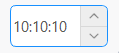

## 简介
`MTimeEdit` 类继承自 `QTimeEdit`，用于创建一个带有大小属性的时间选择器。

******
## 初始化
  - `time_edit = MTimeEdit(time=QtCore.QTime.currentTime())`
    - `time`: 设置初始时间，当前时间 `QtCore.QTime.currentTime()`。
********
## 设置范围
  - `time_edit.setTimeRange(QTime(10, 10, 10, 10), QTime(10, 10, 10, 10))`
******
## 设置值
  - `time_edit.setTime(QTime(10, 10, 10, 10))`
## 设置控件大小
  - `time_edit.huge()  # 设置为巨大尺寸`
  - `time_edit.large()  # 设置为大尺寸`
  - `time_edit.medium()  # 设置为中尺寸`
  - `time_edit.small()  # 设置为小尺寸`
  - `time_edit.tiny()  # 设置为微小尺寸`
******
## 设置显示格式
  - `time_edit.setDisplayFormat("HH:mm:ss")`
******
## 示例代码

```python
import asyncio
from PySide2.QtCore import QTime
from PySide2.QtWidgets import QWidget, QApplication, QVBoxLayout
from qasync import QEventLoop
from dayu_widgets import MTheme, MFieldMixin, MTimeEdit
class DemoWidget(QWidget, MFieldMixin):
    def __init__(self, parent=None):
        super(DemoWidget, self).__init__(parent)
        self.setWindowTitle("MPushButton控件学习")
        # 布局
        self.main_layout = QVBoxLayout()
        self.setLayout(self.main_layout)
        time_edit = MTimeEdit(time=QTime.currentTime()).large()
        time_edit.setTimeRange(QTime(10, 10, 10, 10), QTime(10, 10, 10, 10))
        time_edit.setTime(QTime(10, 10, 10, 10))
        time_edit.setDisplayFormat("HH:mm:ss")
        self.main_layout.addWidget(time_edit)
if __name__ == '__main__':
    # 创建主循环
    app = QApplication([])
    # 创建异步事件循环
    loop = QEventLoop(app)
    asyncio.set_event_loop(loop)
    # 创建窗口
    demo_widget = DemoWidget()
    MTheme().apply(demo_widget)
    # 显示窗口
    demo_widget.show()
    loop.run_forever()