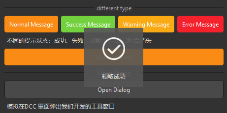

## 简介
`MToast` 是一个基于 `QtWidgets.QWidget` 的自定义 `Toast` 组件，适用于需要显示短暂消息提示的场景。该组件支持多种消息类型（信息、成功、警告、错误、加载）和自定义持续时间，并且具有平滑的淡入淡出动画效果。


******
## 基本用法
  - `toast = MToast(text="This is a toast message",duration=None, dayu_type=None, parent=None)`
    - `text: 显示的消息文本`
    - `duration: 消息显示的持续时间（秒），默认为 2 秒。`
    - `dayu_type: 消息类型，默认为 MToast.InfoType。`
********
## 消息类型
  - `InfoType: 信息提示。`
  - `SuccessType: 成功提示。`
  - `WarningType: 警告提示。`
  - `ErrorType: 错误提示。`
  - `LoadingType: 加载提示。`
******
## 显示消息
  - `MToast.info("This is an info message", parent=your_parent_widget) # 显示信息提示`
  - `MToast.success("This is a success message", parent=your_parent_widget) # 显示成功提示`
  - `MToast.warning("This is a warning message", parent=your_parent_widget) # 显示警告提示`
  - `MToast.error("This is an error message", parent=your_parent_widget) # 显示错误提示`
  - `MToast.loading("Loading...", parent=your_parent_widget) # 显示加载提示`
******
## 自定义持续时间
可以通过 config 方法配置全局的持续时间：
  - `MToast.config(duration=3)  # 设置全局持续时间为3秒`
******
## 信号
  - `sig_closed: Toast 消息关闭时发出的信号。`
******
## 属性
  - `default_config: 全局配置，包括默认持续时间。`
******
## 示例代码

```python
import functools
from Qt import QtCore
from Qt import QtWidgets
from dayu_widgets.divider import MDivider
from dayu_widgets.field_mixin import MFieldMixin
from dayu_widgets.label import MLabel
from dayu_widgets.push_button import MPushButton
from dayu_widgets.toast import MToast
class MWorkThread(QtCore.QThread):
    def __init__(self, parent=None):
        super(MWorkThread, self).__init__(parent)
    def run(self):
        import time
        time.sleep(3)
class MDialogExample(QtWidgets.QDialog):
    def __init__(self, parent=None):
        super(MDialogExample, self).__init__(parent=parent)
        main_lay = QtWidgets.QVBoxLayout()
        button = MPushButton("Show Message")
        button.clicked.connect(self.slot_show_message)
        main_lay.addWidget(MLabel("This is a dialog in DCC. Click the button to show a message."))
        main_lay.addWidget(button)
        self.setLayout(main_lay)
    def slot_show_message(self):
        MToast.info(parent=self, text="This is a message")
class ToastExample(QtWidgets.QWidget, MFieldMixin):
    def __init__(self, parent=None):
        super(ToastExample, self).__init__(parent)
        self.setWindowTitle("Examples for MToast")
        self._init_ui()
    def _init_ui(self):
        button3 = MPushButton(text="Normal Message").primary()
        button4 = MPushButton(text="Success Message").success()
        button5 = MPushButton(text="Warning Message").warning()
        button6 = MPushButton(text="Error Message").danger()
        button3.clicked.connect(
            functools.partial(self.slot_show_message, MToast.info, {"text": "好像没啥用"})
        )
        button4.clicked.connect(
            functools.partial(self.slot_show_message, MToast.success, {"text": "领取成功"})
        )
        button5.clicked.connect(
            functools.partial(self.slot_show_message, MToast.warning, {"text": "暂不支持"})
        )
        button6.clicked.connect(
            functools.partial(
                self.slot_show_message, MToast.error, {"text": "支付失败，请重试"}
            )
        )

        sub_lay1 = QtWidgets.QHBoxLayout()
        sub_lay1.addWidget(button3)
        sub_lay1.addWidget(button4)
        sub_lay1.addWidget(button5)
        sub_lay1.addWidget(button6)

        loading_button = MPushButton("Loading Toast").primary()
        loading_button.clicked.connect(self.slot_show_loading)

        main_lay = QtWidgets.QVBoxLayout()
        main_lay.addWidget(MDivider("different type"))
        main_lay.addLayout(sub_lay1)
        main_lay.addWidget(MLabel("不同的提示状态：成功、失败、加载中。默认2秒后消失"))
        main_lay.addWidget(loading_button)

        main_lay.addWidget(MDivider("Open Dialog"))
        button_open_dialog = MPushButton("Open Dialog")
        button_open_dialog.clicked.connect(self.slot_open_dialog)
        main_lay.addWidget(button_open_dialog)
        main_lay.addWidget(MLabel("模拟在DCC 里面弹出我们开发的工具窗口"))

        main_lay.addStretch()
        self.setLayout(main_lay)
    def slot_show_message(self, func, config):
        func(parent=self, **config)
    def slot_set_config(self, func, config):
        func(**config)
    def slot_show_loading(self):
        my_thread = MWorkThread(parent=self)
        my_thread.finished.connect(self.slot_finished)
        my_thread.start()
        self.msg = MToast.loading("正在加载中", parent=self)
    def slot_finished(self):
        self.msg.close()
        MToast.success("加载成功", self)
    def slot_open_dialog(self):
        dialog = MDialogExample(self)
        dialog.exec_()
if __name__ == "__main__":
    # Import local modules
    from dayu_widgets import dayu_theme
    from dayu_widgets.qt import application
    with application() as app:
        test = ToastExample()
        dayu_theme.apply(test)
        test.show()
```