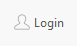

## 简介
`MToolButton` 是一个自定义的 `QToolButton` 类，提供了多种样式和大小设置选项，支持 SVG 图标，并且在鼠标悬停时会高亮显示图标。它适用于需要美观且功能丰富的工具按钮的应用程序。
## 实例化
  - `tool_button = MToolButton(parent=None)`
********
## 设置图标
  - `tool_button.svg("path/to/icon.svg") # 设置自定义图标` 
  - `tool_button.svg("add_line.svg") # 内置图标`
  - `tool_button.set_dayu_svg("add_line.svg")  # 设置图标`
******
## 设置大小
  - `tool_button.huge()  # 设置为巨大尺寸`
  - `tool_button.large()  # 设置为大尺寸`
  - `tool_button.medium()  # 设置为中等尺寸`
  - `tool_button.small()  # 设置为小尺寸`
  - `tool_button.tiny()  # 设置为微小尺寸`
  - `tool_button.set_dayu_size(value:int)  # 自定义工具按钮大小`
******
## 设置文字
  - `tool_button.setText("Login") # 设置文字` 
******
## 设置样式
  - `tool_button.icon_only()  # 设置为仅图标样式`
  - `tool_button.text_only()  # 设置为仅文本样式`
  - `tool_button.text_beside_icon()  # 设置为文本在图标旁边样式`
  - `tool_button.text_under_icon()  # 设置为文本在图标下方样式`
******
## 设置按钮提示
  - `tool_button.setToolTip("提示")`
******
## 设置启用/禁用状态
  - `tool_button.setEnabled(False)`
******
## 设置可选中
  - `tool_button.setCheckable(True)`
******
## 示例代码

```python
import asyncio
from PySide2.QtWidgets import QWidget, QApplication, QVBoxLayout, QHBoxLayout
from qasync import QEventLoop
from dayu_widgets import MTheme, MToolButton
class DemoWidget(QWidget):
    def __init__(self, parent=None):
        super(DemoWidget, self).__init__(parent)
        # 布局
        self.main_layout = QVBoxLayout()
        self.setLayout(self.main_layout)
        self.sub_layout_1 = QHBoxLayout()
        self.main_layout.addLayout(self.sub_layout_1)
        # 设置图标
        tool_button = MToolButton()
        self.sub_layout_1.addWidget(tool_button.svg("add_line.svg"))
        # 设置大小
        tool_button2 = MToolButton().large()
        tool_button2.setText("注册")
        self.sub_layout_1.addWidget(tool_button2)
        # 设置大小
        tool_button1 = MToolButton().svg("add_line.svg").large()
        self.sub_layout_1.addWidget(tool_button1)
        # 设置文字
        button_login = MToolButton().svg("user_line.svg")
        button_login.setText("Login")
        # 设置样式
        button_login.text_beside_icon()
        # 按钮提示
        button_login.setToolTip("登录")
        self.sub_layout_1.addWidget(button_login)
        # 启用/禁用
        tool_button3 = MToolButton().svg("add_line.svg").large()
        tool_button3.setEnabled(False)
        self.sub_layout_1.addWidget(tool_button3)
        # 设置可选
        tool_button4 = MToolButton().svg("add_line.svg").large()
        tool_button4.setCheckable(True)
        self.sub_layout_1.addWidget(tool_button4)
if __name__ == '__main__':
    # 创建主循环
    app = QApplication([])
    # 创建异步事件循环
    loop = QEventLoop(app)
    asyncio.set_event_loop(loop)
    # 创建窗口
    demo_widget = DemoWidget()
    MTheme().apply(demo_widget)
    # 显示窗口
    demo_widget.show()
    loop.run_forever()
