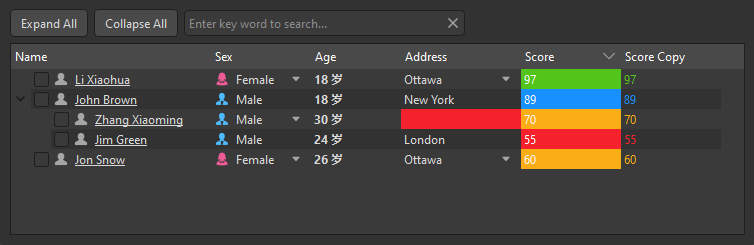

## 简介
`MTreeView` 是一个基于 `QtWidgets.QTreeView` 的自定义树类表格视图类，用于展示数据，并提供了丰富的功能如上下文菜单、无数据时的自定义显示、列头状态保存与加载等。


******
## 初始化
  - `tree_view = MTreeView()`
********
## 模拟数据
  - ```python
    def score_color(score, y):
        if score < 60:
            return dayu_theme.error_color
        elif score < 80:
            return dayu_theme.warning_color
        elif score >= 90:
            return dayu_theme.success_color
        return dayu_theme.info_color

    header_list = [
            {
                "label": "Name",
                "key": "name",
                "checkable": True,  # 是否支持勾选
                "searchable": True,  # 是否支持搜索
                "draggable": True,  # 是否支持拖拽
                "droppable": True,  # 是否支持拖放
                "editable": True,  # 是否支持编辑(如果是下拉框，则无法双击编辑，只能下拉选择)
                "selectable": False,  # 是否支持下拉框选择
                "exclusive": True,  # 下拉框选择是否单选
                "width": 200,
                "font": lambda x, y: {"underline": True, "bold": True},  # 字体样式
                "icon": "user_fill.svg",  # 图标，可以动态图标
                "display": lambda x, y: f"{x} 岁",  # 显示格式化
                "order": "desc",  # 排序
                "bg_color": lambda x, y: "transparent" if x else dayu_theme.error_color,  # 背景颜色
                "color": "#ff00ff",  # 文本颜色
            },
            {
                "label": "Sex",
                "key": "sex",
                "checkable": True,  # 是否支持勾选
                "searchable": True,  # 是否支持搜索
                "editable": True,  # 是否支持编辑
                "draggable": True,  # 是否支持拖拽
                "droppable": True,  # 是否支持拖放
                "selectable": True,
                "icon": lambda x, y: (f"{x.lower()}.svg", getattr(dayu_theme, x.lower() + "_color")),
            },
            {
                "label": "Age",
                "key": "age",
                "width": 90,
                "checkable": True,  # 是否支持勾选
                "searchable": True,  # 是否支持搜索
                "editable": True,  # 是否支持编辑
                "draggable": True,  # 是否支持拖拽
                "droppable": True,  # 是否支持拖放
                "display": lambda x, y: "{} 岁".format(x),
                "font": lambda x, y: {"bold": True},
            },
            {
                "label": "Address",
                "key": "city",
                "checkable": True,  # 是否支持勾选
                "searchable": True,  # 是否支持搜索
                "editable": True,  # 是否支持编辑
                "draggable": True,  # 是否支持拖拽
                "droppable": True,  # 是否支持拖放
                "selectable": True,
                "exclusive": True,
                "width": 120,
                "display": lambda x, y: " & ".join(x) if isinstance(x, list) else x,
                "bg_color": lambda x, y: "transparent" if x else dayu_theme.error_color,
            },
            {
                "label": "Score",
                "key": "score",
                "searchable": True,
                "editable": True,
                "order": "desc",
                "bg_color": score_color,
                "color": "#fff",
            },
            {
                "label": "Score Copy",
                "key": "score",
                "searchable": True,
                "color": score_color
            },
            {
                "label": "日期",
                "key": "date",
                "searchable": True,
                "color": '#eaa'
            },
        ]

    tree_data_list = [
              {
                  "name": "John Brown",
                  "sex": "Male",
                  "sex_list": ["Male", "Female"],
                  "age": 18,
                  "score": 89,
                  "city": "New York",
                  "city_list": ["New York", "Ottawa", "London", "Sydney"],
                  "date": "2016-10-03",
                  "children": [
                      {
                          "name": "Jim Green",
                          "sex": "Male",
                          "sex_list": ["Male", "Female"],
                          "age": 24,
                          "score": 55,
                          "city": "London",
                          "city_list": ["New York", "Ottawa", "London", "Sydney"],
                          "date": "2016-10-01",
                      },
                      {
                          "name": "Zhang Xiaoming",
                          "sex": "Male",
                          "sex_list": ["Male", "Female"],
                          "age": 30,
                          "score": 70,
                          "city": "",
                          "city_list": ["Beijing", "Shanghai", "Shenzhen", "Guangzhou"],
                          "date": "2016-10-02",
                      },
                  ],
              },
              {
                  "name": "Jon Snow",
                  "sex": "Female",
                  "sex_list": ["Male", "Female"],
                  "age": 26,
                  "score": 60,
                  "city": "Ottawa",
                  "city_list": ["New York", "Ottawa", "London", "Sydney"],
                  "date": "2016-10-04",
              },
              {
                  "name": "Li Xiaohua",
                  "sex": "Female",
                  "sex_list": ["Male", "Female"],
                  "age": 18,
                  "score": 97,
                  "city": "Ottawa",
                  "city_list": ["New York", "Ottawa", "London", "Sydney"],
                  "date": "2016-10-04",
              },
        ]
    ```
******
## 构建数据模型
  - ```python
    data_list = [...]
    model = MTableModel()
    model.set_header_list(header_list)
    model.set_data_list(tree_data_list)
    ```
******
## 构建排序模型
  - ```python
    # 构建排序模型
    self.model_sort = MSortFilterModel()
    self.model_sort.setSourceModel(model)
    self.model_sort.set_header_list(header_list)
    ```
******
## 构建表格
  - ```python
    # 构建表格
    table_view = MTreeView()
    table_view.setModel(self.model_sort)
    table_view.set_header_list(header_list)
    ```
******
## 搜索功能
  - ```python
    # 搜索栏
    line_edit = MLineEdit().search().small()
    line_edit.textChanged.connect(self.model_sort.set_search_pattern)
    ```
******
## 收起/展开功能
  - ```python
    expand_all_button = MPushButton("Expand All").small()
    expand_all_button.clicked.connect(tree_view.expandAll)
    collapse_all_button = MPushButton("Collapse All").small()
    collapse_all_button.clicked.connect(tree_view.collapseAll)
    ```
******
## 示例代码

```python
import asyncio
from PySide2.QtWidgets import QWidget, QApplication, QVBoxLayout, QHBoxLayout
from qasync import QEventLoop
from dayu_widgets import MTheme, MFieldMixin, dayu_theme, MTableModel, MSortFilterModel, MLineEdit, \
    MTableView, MPushButton, MTreeView
class DemoWidget(QWidget, MFieldMixin):
    def __init__(self, parent=None):
        super(DemoWidget, self).__init__(parent)
        layout = QVBoxLayout()
        self.setLayout(layout)
        def score_color(score, y):
            if score < 60:
                return dayu_theme.error_color
            elif score < 80:
                return dayu_theme.warning_color
            elif score >= 90:
                return dayu_theme.success_color
            return dayu_theme.info_color
        header_list = [
            {
                "label": "Name",
                "key": "name",
                "checkable": True,  # 是否支持勾选
                "searchable": True,  # 是否支持搜索
                "draggable": True,  # 是否支持拖拽
                "droppable": True,  # 是否支持拖放
                "editable": True,  # 是否支持编辑(如果是下拉框，则无法双击编辑，只能下拉选择)
                "selectable": False,  # 是否支持下拉框选择
                "exclusive": True,  # 下拉框选择是否单选
                "width": 200,
                "font": lambda x, y: {"underline": True, "bold": True},  # 字体样式
                "icon": "user_fill.svg",  # 图标，可以动态图标
                "display": lambda x, y: f"{x} 岁",  # 显示格式化
                "order": "desc",  # 排序
                "bg_color": lambda x, y: "transparent" if x else dayu_theme.error_color,  # 背景颜色
                "color": "#ff00ff",  # 文本颜色
            },
            {
                "label": "Sex",
                "key": "sex",
                "checkable": True,  # 是否支持勾选
                "searchable": True,  # 是否支持搜索
                "editable": True,  # 是否支持编辑
                "draggable": True,  # 是否支持拖拽
                "droppable": True,  # 是否支持拖放
                "selectable": True,
                "icon": lambda x, y: (f"{x.lower()}.svg", getattr(dayu_theme, x.lower() + "_color")),
            },
            {
                "label": "Age",
                "key": "age",
                "width": 90,
                "checkable": True,  # 是否支持勾选
                "searchable": True,  # 是否支持搜索
                "editable": True,  # 是否支持编辑
                "draggable": True,  # 是否支持拖拽
                "droppable": True,  # 是否支持拖放
                "display": lambda x, y: "{} 岁".format(x),
                "font": lambda x, y: {"bold": True},
            },
            {
                "label": "Address",
                "key": "city",
                "checkable": True,  # 是否支持勾选
                "searchable": True,  # 是否支持搜索
                "editable": True,  # 是否支持编辑
                "draggable": True,  # 是否支持拖拽
                "droppable": True,  # 是否支持拖放
                "selectable": True,
                "exclusive": True,
                "width": 120,
                "display": lambda x, y: " & ".join(x) if isinstance(x, list) else x,
                "bg_color": lambda x, y: "transparent" if x else dayu_theme.error_color,
            },
            {
                "label": "Score",
                "key": "score",
                "searchable": True,
                "editable": True,
                "order": "desc",
                "bg_color": score_color,
                "color": "#fff",
            },
            {
                "label": "Score Copy",
                "key": "score",
                "searchable": True,
                "color": score_color
            },
            {
                "label": "日期",
                "key": "date",
                "searchable": True,
                "color": '#eaa'
            },
        ]
        tree_data_list = [
            {
                "name": "John Brown",
                "sex": "Male",
                "sex_list": ["Male", "Female"],
                "age": 18,
                "score": 89,
                "city": "New York",
                "city_list": ["New York", "Ottawa", "London", "Sydney"],
                "date": "2016-10-03",
                "children": [
                    {
                        "name": "Jim Green",
                        "sex": "Male",
                        "sex_list": ["Male", "Female"],
                        "age": 24,
                        "score": 55,
                        "city": "London",
                        "city_list": ["New York", "Ottawa", "London", "Sydney"],
                        "date": "2016-10-01",
                    },
                    {
                        "name": "Zhang Xiaoming",
                        "sex": "Male",
                        "sex_list": ["Male", "Female"],
                        "age": 30,
                        "score": 70,
                        "city": "",
                        "city_list": ["Beijing", "Shanghai", "Shenzhen", "Guangzhou"],
                        "date": "2016-10-02",
                    },
                ],
            },
            {
                "name": "Jon Snow",
                "sex": "Female",
                "sex_list": ["Male", "Female"],
                "age": 26,
                "score": 60,
                "city": "Ottawa",
                "city_list": ["New York", "Ottawa", "London", "Sydney"],
                "date": "2016-10-04",
            },
            {
                "name": "Li Xiaohua",
                "sex": "Female",
                "sex_list": ["Male", "Female"],
                "age": 18,
                "score": 97,
                "city": "Ottawa",
                "city_list": ["New York", "Ottawa", "London", "Sydney"],
                "date": "2016-10-04",
            },
        ]
        # 构建数据模型
        model = MTableModel()
        model.set_header_list(header_list)
        model.set_data_list(tree_data_list)
        # 构建排序模型
        model_sort = MSortFilterModel()
        model_sort.setSourceModel(model)
        model_sort.set_header_list(header_list)

        tree_view = MTreeView()
        tree_view.setModel(model_sort)
        tree_view.set_header_list(header_list)

        # 搜索栏
        line_edit = MLineEdit().search().small()
        line_edit.textChanged.connect(model_sort.set_search_pattern)

        expand_all_button = MPushButton("Expand All").small()
        expand_all_button.clicked.connect(tree_view.expandAll)
        collapse_all_button = MPushButton("Collapse All").small()
        collapse_all_button.clicked.connect(tree_view.collapseAll)
        button_lay = QHBoxLayout()
        button_lay.addWidget(expand_all_button)
        button_lay.addWidget(collapse_all_button)
        button_lay.addWidget(line_edit)
        button_lay.addStretch()

        layout.addLayout(button_lay)
        layout.addWidget(tree_view)

        layout.addStretch()
if __name__ == '__main__':
    # 创建主循环
    app = QApplication([])
    # 创建异步事件循环
    loop = QEventLoop(app)
    asyncio.set_event_loop(loop)
    # 创建窗口
    demo_widget = DemoWidget()
    MTheme("dark").apply(demo_widget)
    # 显示窗口
    demo_widget.show()
    loop.run_forever()
```